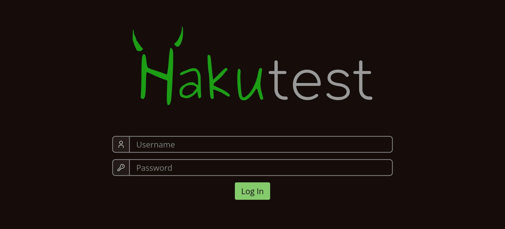
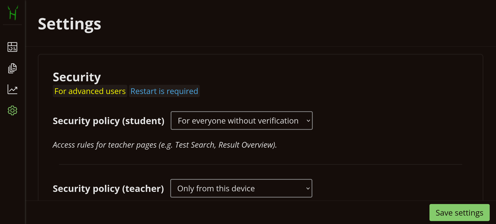

# Security

---

> [!TIP] You will learn:
>
> -   Hakutest security model and principles
> -   How to configure Hakutest in terms of security

## Overview

Security is the essential part of Hakutest. The platform implements a reliable
and robust security model while leaving possibilities for configuration.

## Security model

Hakutest's security model is based on roles and policies.

Roles define which page or action (route) is available to a particular user.
Each route is marked as available to a set of roles. Essentially, [student
interface](/handbook/guide/06-student-perspective) is available to users with
the role "student" and teacher interface (pages such as
[Dashboard](/handbook/guide/02-dashboard), [Test
menu](/handbook/guide/03-tests#tests-menu),
[Settings](/handbook/guide/05-settings), etc.) is available to users with the
role "teacher".

Policies determine whether a user fulfils a particular role. Different policies
can be applied to different roles and one policy can be applied to each role.

Currently, Hakutest implements 3 security policies:

-   [No verification](#no-verification)
-   [Credentials](#credentials)
-   [Only this device](#hostonly)

### For everyone without verification {#no-verification}

Allows anyone to access route without additional verification.

> [!TIP]
> By default, this policy is applied for **students**.

### By username and password {#credentials}

Requires user to authorize by entering their credentials (username and
password).

After successful authorization, Hakutest remembers the user, so no credentials
entry will be required for future requests.

When using this security policy, Hakutest needs to store usernames and passwords
in a database. Currently the platform supports 3 dialects:

-   **SQLite** (default) &mdash; credentials are stored in a local file.
-   **MySQL**
-   **PostgreSQL**

For configuring credentials storage, see [below](#configuration).

> [!TIP]
> For user management you can use any admin panel compatible with the database
> used. Hakutest stores user data in the `hakutest_users` table.

### Only this device {#hostonly}

Route can be accessed only from the same device on which server is running (i.e.
only from the host). This essentially means that you, as a teacher, will have
access, but students will not.

> [!TIP]
> By default, this policy is applied for **teacher**.

## Configuration

Although default security settings of Hakutest are robust, you can adjust them
to suit your needs. For example, you may need to store user data in your
educational institution's database.

Hakutest security can be configured on the [Settings
page](/handbook/guide/05-settings).

| Option                        | Description                                                     | Note                                                                                                                              |
| ----------------------------- | --------------------------------------------------------------- | --------------------------------------------------------------------------------------------------------------------------------- |
| **Security policy (student)** | Security policy applied to student interface                    | &ndash;                                                                                                                           |
| **Security policy (teacher)** | Security policy applied to teacher interface                    | &ndash;                                                                                                                           |
| **Users DB dialect**          | Dialect of the database containing the user data                | &ndash;                                                                                                                           |
| **Users DB DSN**              | DSN (Data Source Name) of the database containing the user data | For `SQLite` dialect &mdash; path to the database file.  For `MySQL` and `PostgreSQL` dialects &mdash; a connection string. |

> [!NOTE]
> All security settings require a restart to take effect.

## Common mistakes (don'ts)

> [!CAUTION]
> Do not under any circumstances do what is described below!

### Applying "No verification" policy to teacher interface

**This is very dangerous**. It allows anyone to access teacher interface: change
settings, delete tests and results, etc.

### Applying "Only this device" policy to student interface

This will make Hakutest unusable as students will not be able to access the
tests.

### Changing dialect without changing the DSN

Since the DSN varies depending on the database used, you must change both the
dialect itself and the DSN. Otherwise Hakutest will not be able to connect to
the database.
