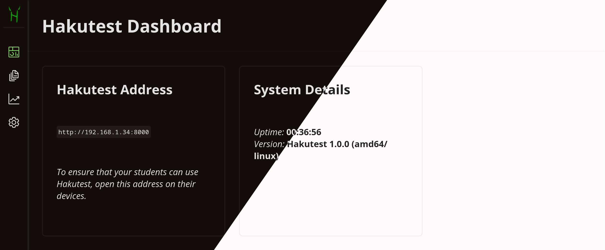

# Teacher Dashboard

---

> [!TIP] You will learn:
>
> -   What are the features of the Hakutest Dashboard
> -   How to find out information about the Hakutest server

> [!TIP]
> Hakutest automatically switches between light and dark themes depending on
> your browser/operating system settings. The dark theme will be used in the
> handbook from now on.

## Overview

The dashboard allows you to control Hakutest directly from your browser. It
allows you to:

-   View information about Hakutest (see [below](#home-page-of-the-dashboard))
-   Manage tests available for your students (see [Tests](/handbook/guide/03-tests.md));
-   Manage your students' results and export statistics (see [Results and
    Statistics](/handbook/guide/04-results-and-statistics.md));
-   Manage Hakutest settings (see [Settings](/handbook/guide/05-settings.md)).

## Home page of the dashboard

Home page of the dashboard provides information about running Hakutest server.

### Hakutest Address

Hakutest automatically detects the local IP address of your device. Your
students can use it to access Hakutest. Open this address (in our example,
`http://192.168.1.34:8000`) on your students' devices so that they can open
tests, send solutions, etc.

> [!IMPORTANT]
> By default, you can only open the dashboard from the device running the
> server. We recommend that you check this by trying to open the
> `/teacher/dashboard` page from another device. For example, if the server is
> available at `http://192.168.1.34:8000`, open
> `http://192.168.1.34/teacher/dashboard` on a different device. The [Test
> Search](/handbook/guide/06-student-perspective#test-search) should be opened
> instead.
>
> See Security for more details.

<!-- TODO: link to the security settings page -->

### System Details

In the "System Details" section, you can see information about the system:

-   the Hakutest version (including operating system and CPU architecture);
-   Server uptime.
