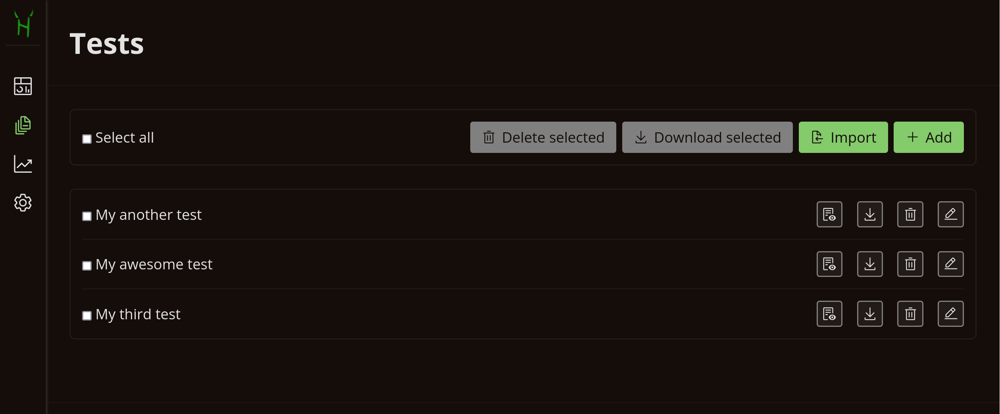
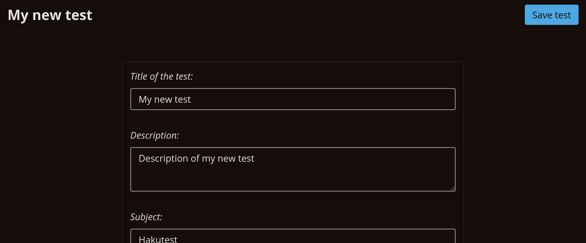
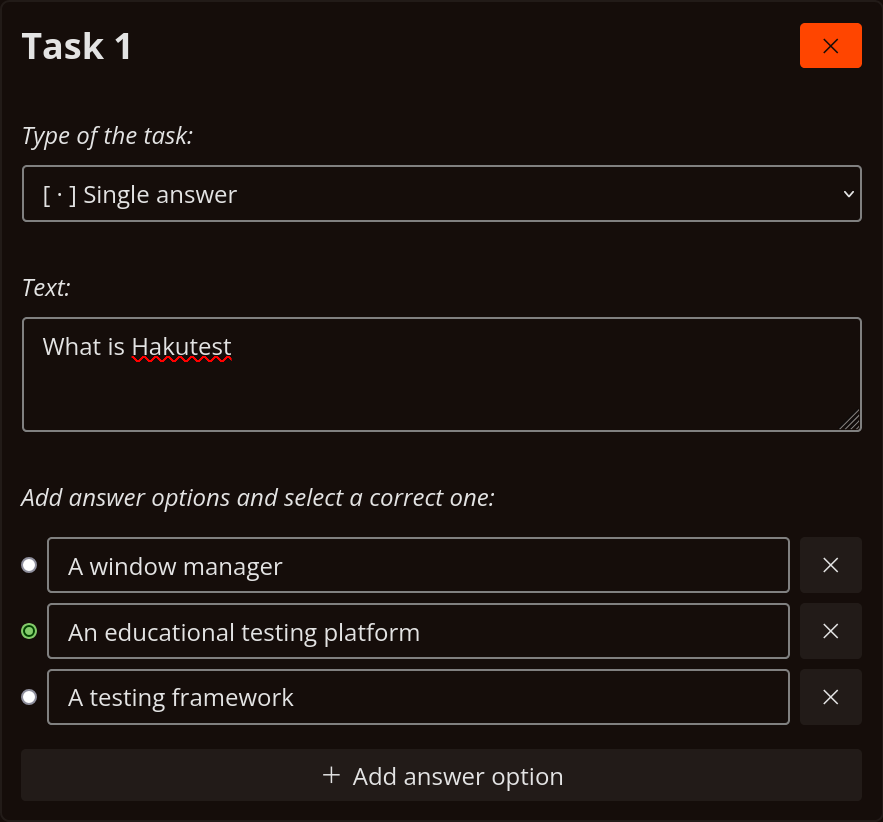
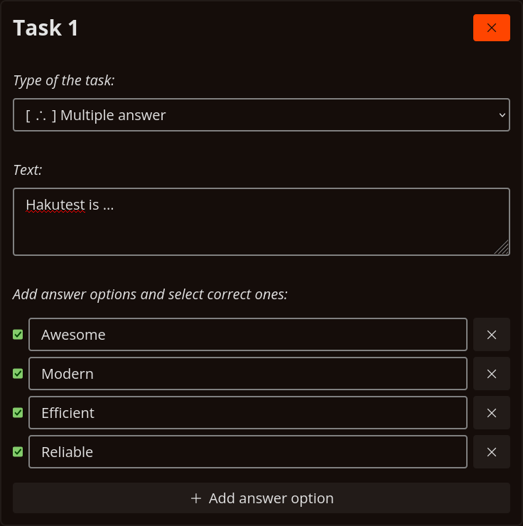
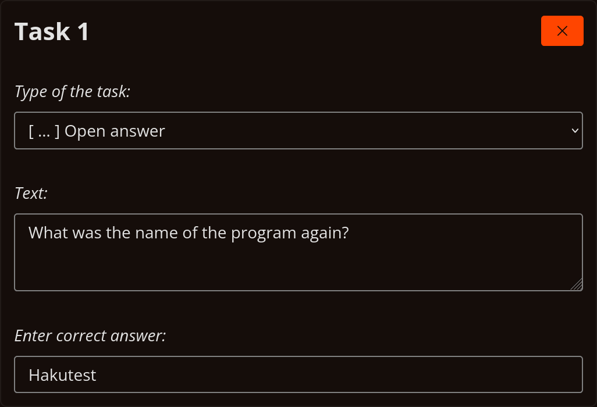
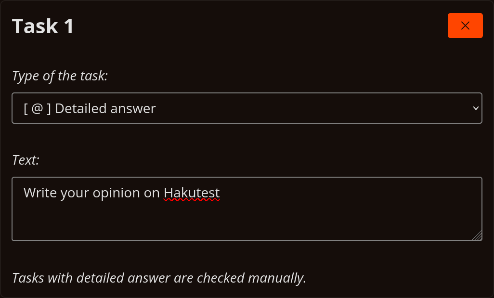

# Tests

---

> [!TIP] You will learn:
>
> -   How to manage your tests using the menu
> -   How to create and edit tests via Hakutest test editor

## Overview

Test management is a fundamental component of Hakutest. It allows you to
perform a number of operations on the tests available to your students. The
integrated editor enables the creation of coherent tests, quizzes, and even
exam variants.

## Tests menu



Tests menu is a file manager-like interface that allows to manage your tests.
The following describes the actions you can perform in the menu:

| Button                                                                                         | Action                                        |
| :--------------------------------------------------------------------------------------------- | :-------------------------------------------- |
| <button class="button button__primary"><i class="i add"></i> Add</button>                      | Create new test in the [editor](#test-editor) |
| <button class="button button__primary"><i class="i import"></i> Import</button>                | Import existing test from `.json` file        |
| <button class="button button__danger"><i class="i trash-can"></i> Delete selected</button>     | Delete selected tests                         |
| <button class="button button__secondary"><i class="i download"></i> Download selected</button> | Download selected tests as `.zip` archive     |
| <button class="guide-action"><i class="i download"></i></button>                               | Download this test as `.json` file            |
| <button class="guide-action"><i class="i trash-can"></i></button>                              | Delete this test                              |
| <button class="guide-action"><i class="i edit"></i></button>                                   | [Edit](#test-editor) this test                |
| <button class="guide-action"><i class="i view"></i></button>                                   | Preview this test                             |

> [!TIP]
> Importing tests from JSON files can be useful for sharing tests between
> multiple teachers. Download the tests and send them to another teacher to
> use.

## Test editor



Test editor allows you to create and edit your tests with ease. You need to
fill the [general fields](#general-fields), add [tasks](#tasks), and [save the
test](#saving-the-test).

### General fields

General fields are described in the table below:

| Field                  | Description                                                              | Example                                |
| :--------------------- | :----------------------------------------------------------------------- | :------------------------------------- |
| **Title** (_required_) | This field is displayed in the menu and is used when searching for tests | _My test_                              |
| **Description**        | Description of the test                                                  | _Computer science test for 9th grades_ |
| **Subject**            | Subject of the test                                                      | _Computer Science_                     |
| **Author**             | Author of the test                                                       | _John Doe_                             |
| **Target audience**    | Who the test is for                                                      | _9th grade students_                   |
| **Institution**        | The educational institution where the test is conducted                  | _Hakutest Academy_                     |
| **Expires At**         | Expiration time of the test. Leave blank for the test to be indefinite   | _06/28/2032 08:00 PM_                  |

### Tasks

Each task contains the following information:

-   [Type](#task-types) of the task;
-   [Text](#task-text) of the task;
-   [Options and correct answer](#task-types) of the task (depend on the task type).

### Task text

Task text typically represents the terms of those tasks. You can use
[Markdown](https://en.wikipedia.org/wiki/Markdown) syntax it. Below are
examples of task texts:

:::details Text styles

<!-- prettier-ignore-start -->
```markdown
*italic*

**bold**

***bold italic***

~~strikethrough~~

`monospace`

> Quote
```
<!-- prettier-ignore-end -->

---

_italic_

**bold**

**_bold italic_**

~~strikethrough~~

`monospace`

> Quote

:::

:::details Headings

```markdown
### My awesome task

Lorem ipsum dolor sit amet.
```

---

### My awesome task

Lorem ipsum dolor sit amet.

:::

:::details Subscript and superscript

```markdown
Every programmer knows that 2^10^ equals 1024.

Stay hydrated! Drink more H~2~O!
```

---

Every programmer knows that 2<sup>10</sup> equals 1024.

Stay hydrated! Drink more H<sub>2</sub>O!

:::

:::details Links and images

```markdown
[Hakutest](https://hakutest.org)


```

---

[Hakutest](https://hakutest.org)


:::

:::details Tables and lists

```markdown
|  #  | Name                    | Price |
| :-: | :---------------------- | ----: |
|  1  | Pencil box x150         |   $20 |
|  2  | Colored pencil box x150 |  $120 |

Ordered list:

1. Item 1
2. Item 2
3. Item 3

Unordered (bullet) list:

-   Item
-   Another item
-   Third item
```

---

|  #  | Name                    | Price |
| :-: | :---------------------- | ----: |
|  1  | Pencil box x150         |   $20 |
|  2  | Colored pencil box x150 |  $120 |

Ordered list:

1. Item 1
2. Item 2
3. Item 3

Unordered (bullet) list:

-   Item
-   Another item
-   Third item

:::

> [!TIP] Keyboard Shortcuts
> Hakutest test editor supports a number of keyboard shortcuts (hotkeys) that can be useful to increase the speed of work.
>
> |     Hotkey     | Inserted markup   |
> | :------------: | ----------------- |
> |    `Ctrl+B`    | **Bold**          |
> |    `Ctrl+I`    | _Italic_          |
> |    `Ctrl+K`    | [Link](#)         |
> | `Ctrl+Shift+X` | ~~Strikethrough~~ |
> | `Ctrl+Shift+M` | `Monospace`       |

#### Task types

There are 4 types of tasks in Hakutest:

-   **Single answer** &mdash; Student has to choose one answer option;
-   **Multiple answers** &mdash; Student has to choose multiple answer options;
-   **Open answer** &mdash; Student has to enter a short answer;
-   **Detailed answer** &mdash; Student has to enter a detailed answer.

> [!IMPORTANT]
>
> **Single answer**, **multiple answer** and **open answer** tasks are checked
> automatically by Hakutest. You select (or enter) the correct answer(s), and
> Hakutest checks them.
>
> **Detailed answer** tasks are checked manually by the teacher. During the
> check, Hakutest marks the answer as correct if it is not blank, and as
> incorrect otherwise.

The following are examples for each type of task:

:::details Single answer



:::

:::details Multiple answers



:::

:::details Open answer

> [!NOTE]
> The register does not affect the correctness of the answer.



:::

:::details Detailed answer



:::

### Saving the test

When you have finished editing the test, click the "Save test" button. Hakutest
will automatically save the test and then it will be available to your
students.

<button class="button button__secondary">Save test</button>
