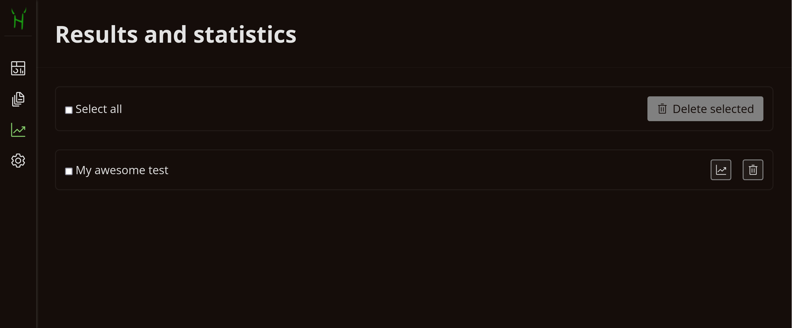

# Results and Statistics

---

> [!TIP] You will learn:
>
> -   How to manage results of your students using the menu
> -   How to generate result statistics
> -   How to export statistics to supported formats

## Overview

Results management is one of the key features of Hakutest, offering flexible
options for effectively tracking and monitoring your students' progress. With
this functionality you can gain valuable insight into your students'
performance, enabling you to identify areas where they excel or struggle.

## Results menu



Results menu is a file manager-like interface that allows to manage results of
your students. Each entry represents a set of results for a given test. The
following table describes the actions you can perform in the menu:

| Button                                                                                     | Action                                                     |
| ------------------------------------------------------------------------------------------ | ---------------------------------------------------------- |
| <button class="button button__danger"><i class="i trash-can"></i> Delete selected</button> | Delete selected results                                    |
| <button class="guide-action"><i class="i trash-can"></i></button>                          | Delete results for this test                               |
| <button class="guide-action"><i class="i analytics"></i></button>                          | Generate [statistics](#statistics) for this set of results |

## Statistics

You can generate result statistics for each test by clicking on the button as
described above. Hakutest will generate a similar page for the given set of
results:


Results can be sorted by any of the columns displayed, i.e:

-   By student name;
-   By points scored;
-   By percentage scored;
-   By submission time;
-   By correctness of each answer in the test.

Click the column header to apply the sort condition. Click again to reverse the
order.

> [!TIP]
> Hover over the answer cells to see the student's answers.

## Exporting statistics

You may need to export the statistics into an easy-to-use format to perform
additional operations or create a report. Hakutest supports the following
export formats:

-   **XLSX** (Microsoft Excel®) &mdash; recommended for most users;
-   **JSON**;
-   **CSV**.

To export statistics:

1. Select a format;
2. Click on the "Export" button.

<button class="button button__primary">Export</button>

---

Statistics in the chosen format will be downloaded. Below are examples for each
supported format:

:::details XLSX

> [!TIP]
>
> <b :class="$style.correct">Green</b> cells indicate correct answers.
>
> <b :class="$style.incorrect">Red</b> cells indicate incorrect answers.
>
> <b :class="$style.detailed">Yellow</b> cells indicate a detailed answers that need to be checked manually.
>
> ---
>
> **The formatting may vary depending on the table processor.**


:::

:::details JSON

> [!IMPORTANT]
> Answers in JSON are zero-indexed, meaning that the first answer is 0, the
> second is 1, etc.
>
> For example, answer `2` in exported JSON file means that the student has
> chosen option 3.

```json
[
    {
        "student": "Jane",
        "submitted_at": "2024-07-23T03:51:37.179852518+03:00",
        "answers": [
            {
                "type": "multiple",
                "value": "1,2",
                "correct": true
            },
            {
                "type": "open",
                "value": "Hakutest",
                "correct": true
            },
            {
                "type": "single",
                "value": "2",
                "correct": false
            },
            {
                "type": "open",
                "value": "674",
                "correct": true
            },
            {
                "type": "open",
                "value": "-6",
                "correct": true
            },
            {
                "type": "detailed",
                "value": "",
                "correct": false
            }
        ],
        "percentage": 66,
        "points": 4,
        "total": 6
    },
    {
        "student": "William",
        "submitted_at": "2024-07-23T03:52:17.758674112+03:00",
        "answers": [
            {
                "type": "multiple",
                "value": "1,2",
                "correct": true
            },
            {
                "type": "open",
                "value": "Hakutest",
                "correct": true
            },
            {
                "type": "single",
                "value": "0",
                "correct": true
            },
            {
                "type": "open",
                "value": "674",
                "correct": true
            },
            {
                "type": "open",
                "value": "1",
                "correct": false
            },
            {
                "type": "detailed",
                "value": "A detailed answer.",
                "correct": true
            }
        ],
        "percentage": 83,
        "points": 5,
        "total": 6
    }
]
```

:::

:::details CSV

> [!IMPORTANT]
> Answers in CSV are zero-indexed, meaning that the first answer is 0, the
> second is 1, etc.
>
> For example, answer `1,2` in exported CSV file means that the student has
> chosen options 2 and 3.

```csv
Jane,4,66,2024-07-23 03:51:37,"1,2",Hakutest,2,674,-6,
Mark,2,33,2024-07-23 03:51:05,"0,1",Hakutest,2,326,-6,
William,5,83,2024-07-23 03:52:17,"1,2",Hakutest,0,674,1,A detailed answer.
```

:::

<style module>
.correct {
    padding: 4px;
    background: #A4D2AA;
    color: #2C7135;
}

.incorrect {
    padding: 4px;
    background: #D68282;
    color: #870E0F;
}

.detailed {
    padding: 4px;
    background: #DDD645;
    color: #38201D;
}
</style>
