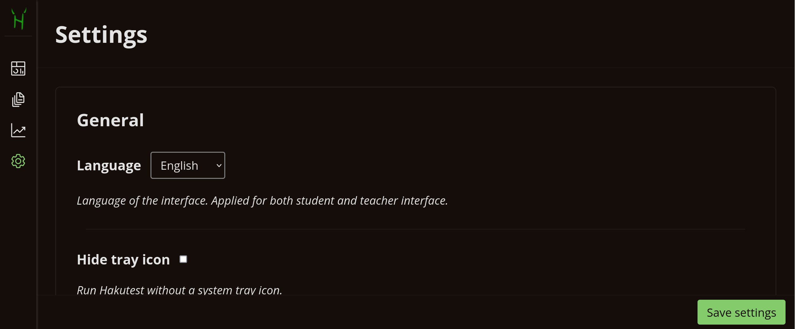

# Settings

---

> [!TIP] You will learn:
>
> -   How to configure Hakutest

Although Hakutest is designed to work out of the box, you may want to adjust
some options to suit your needs. You can customise Hakutest directly from your
browser in the teacher dashboard.

## Basic configuration

> [!NOTE]
> Basic parameters can be changed at any time and do not require a restart.
> These are the settings you will change most often.

The following tables describes basic options that can be configured:

| Option                | Description                                                                     |
| --------------------- | ------------------------------------------------------------------------------- |
| **Language**          | Language of the Hakutest interface                                              |
| **Overwrite results** | Whether to overwrite the results when a student resubmits answers               |
| **Show results**      | Whether to show the student the [result page](#) after submitting their answers |

<!-- TODO: Add link to student interace page -->

## Intermediate configuration

> [!WARNING]
> Intermediate configuration requires an understanding of how Hakutest works.
> We recommend that you change these parameters only when necessary.

| Option                | Description                                                                       | Note                                                                                                                       |
| --------------------- | --------------------------------------------------------------------------------- | -------------------------------------------------------------------------------------------------------------------------- |
| **Hide systray icon** | Run Hakutest without a [system tray icon](/handbook/guide/01-server#systray-icon) | _Restart is required_                                                                                                      |
| **Debug**             | Run Hakutest in debug mode                                                        | Allows to see more info in [logs](#)                                                                                       |
| **Port**              | Port on which Hakutest server is started                                          | _Restart is required_  The last 4 digits of Hakutest address, e.g. for `http://192.168.1.34:8080` the port is `8080` |
| **Save results into** | Directory (folder) in which Hakutest stores student results                       | The path must exist                                                                                                        |
| **Save tests into**   | Directory (folder) in which Hakutest stores tests                                 | The path must exist                                                                                                        |

<!-- TODO: Add link to logs page -->

> [!TIP] Directory path
> On Windows, you can copy the full path to the directory where you want to store tests or results using the instruction below:
>
> 1. Open File Explorer;
> 2. Browse to the desired folder or create one (e.g. `Documents/Hakutest/Results`);
> 3. Hold down the Shift key and right click on it;
> 4. Select "Copy As Path".

## Security configuration

> [!CAUTION]
> Security setting is intended for advanced users with a fundamental
> understanding of Hakutest. Modify these settings with caution.
>
> ---
>
> For more information on security settings, see [Security](#)

## Applying the settings

When you have finished configuring Hakutest, click the "Save settings" button
to apply the updated parameters. Note that some options require a restart of
Hakutest to take effect.

<button class="button button__primary">Save settings</button>

<!-- TODO: Add link to security page -->
