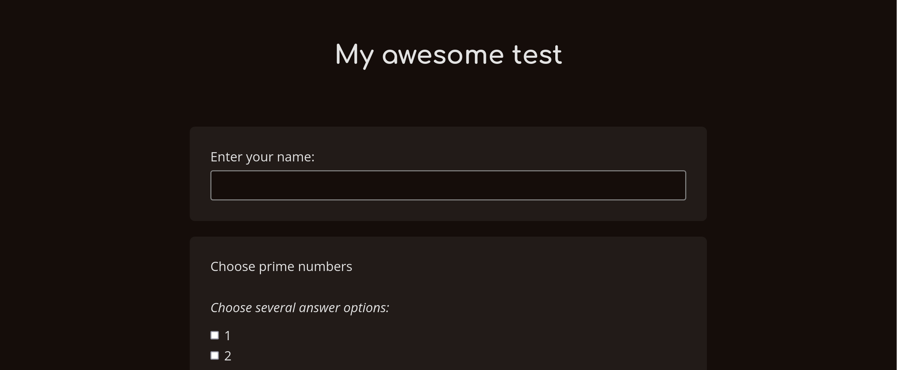
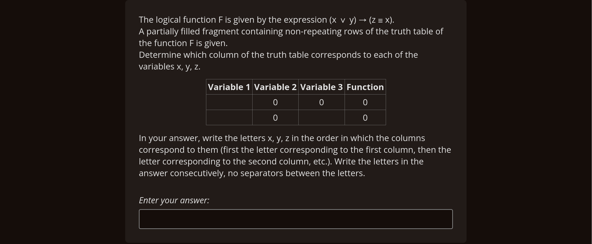
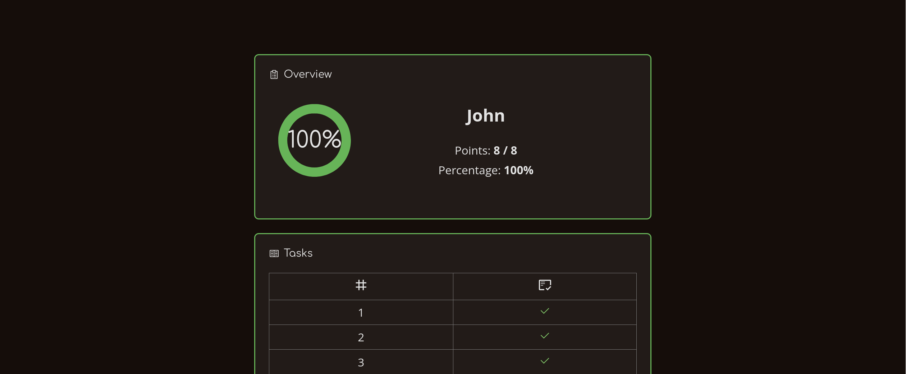
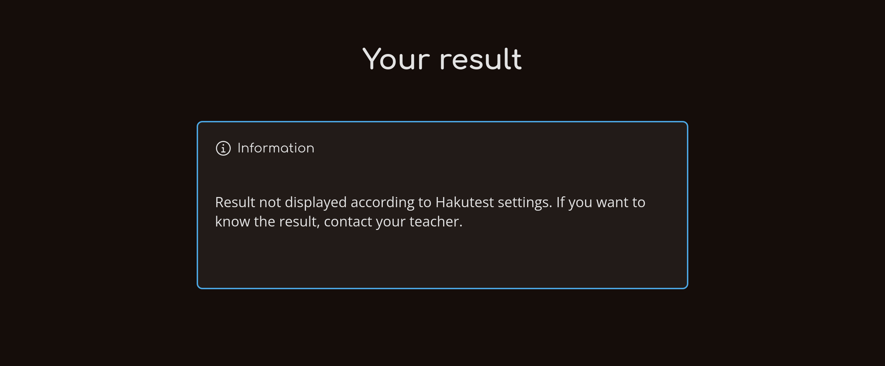

# Student Perspective

---

> [!TIP] You will learn:
>
> -   How students use Hakutest

At this point we have fully covered the teacher's experience of using Hakutest.
Let's have a quick recap what you have learned:

-   Starting and stoping [Hakutest Server](/handbook/guide/01-server);
-   Monitoring server status using the [Teacher Dashboard](/handbook/guide/02-dashboard);
-   Managing [Tests](/handbook/guide/03-tests);
-   Managing [Results and Statistics](/handbook/guide/04-results-and-statistics);
-   [Configuring Hakutest](/handbook/guide/05-settings).

However, it is also worth considering another perspective &mdash; how the
student uses Hakutest.

## Test Search

The main page of the Hakutest student interface is the test search page.

This page allows the student to quickly open the tests. When typing in the
search box, Hakutest will immediately suggest available tests. The student can
select the desired test and press Enter &mdash; the test page will open.

## Test page

The test page allows students to solve the test and submit their answers.

As mentioned in the [Tests](/handbook/guide/03-tests#task-text) chapter, text
of the can contain Markdown. Below is an example of how the text will be seen
by the student.

When the student has finished solving the test, they should click on the
"Submit" button at the bottom of the page.

<button class="button button__primary">Submit</button>

## Test submission

When a student submits a test, Hakutest behaves differently depending on the
[settings](/handbook/guide/05-settings#basic-configuration).

### Whether to overwrite results

> [!TIP]
> This option is **disabled** by default.

If "Overwrite results" option is enabled, Hakutest will overwrite result of
this student if it exists. Below is an example scenario:

1. Student submits answers for the first time;
2. Hakutest saves the submitted answers;
3. Student goes to the test page and submits answers again;
4. Hakutest overwrites the existing result so that the 1st submission is no
   longer available.

### Whether to show results

> [!TIP]
> This option is **enabled** by default.

If the "Show results" option is enabled, Hakutest will show the result to the
student immediately:

Otherwise, an information message is displayed:

