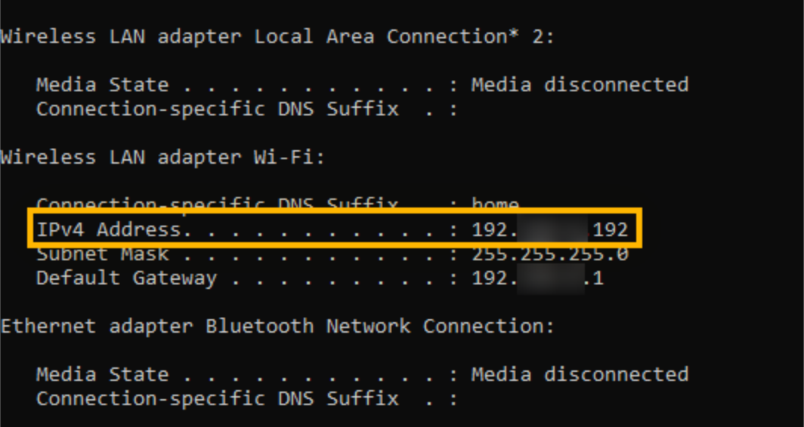

# Manual local IP address detection

Although [Hakutest Dashboard](/handbook/guide/02-dashboard) is able to
determine the local IP of your device, sometimes it may not determine it
correctly. In this case, your students will not be able to access Hakutest at
the suggested address.

You will need to find out the local IP of your device and open the
corresponding address on the students' devices. Below are instructions on how
to manually determine the local IP address.

## Local IP detection

### Windows

#### Method 1: Via Settings

1. Open **Settings**;
2. Select **Network & Internet**;
3. Select **Wi-Fi** in the left panel and click **Advanced Settings** (For
   wired connections, select **Ethernet** and then click **Network
   connection**);
4. View your local IP address under the **IPv4 address** field.

#### Method 2: Via Command Prompt

1. Press <kbd>Win+R</kbd>;
2. Type "cmd" in the prompt and click **OK**;
3. In Command Prompt, type `ipconfig` and hit <kbd>Enter</kbd>;
4. Scroll to **IPv4 Address** to see your local IP address.



### Linux

Run the following command in a shell (terminal):

```shell
ip -o route get to 8.8.8.8 | sed -n 's/.*src \([0-9.]\+\).*/\1/p'
```

Example output:

```
192.168.1.34
```

Alternatively, you can find out the local IP address in your system settings,
depending on the desktop environment you are using.

## What to do after the local IP address is detected

When you have manually detected the local IP address of your device, open it on
your students' devices. Let's consider an example:

-   Your local IP address is `10.0.0.8`;
-   Hakutest is running on port `8080` (which is used by default).

In this case, open `http://10.0.0.8:8080` on another device. The [Test search
page](/handbook/guide/06-student-perspective#test-search) should open.

> [!IMPORTANT]
> Your device and your student's device must be connected to the same network.
