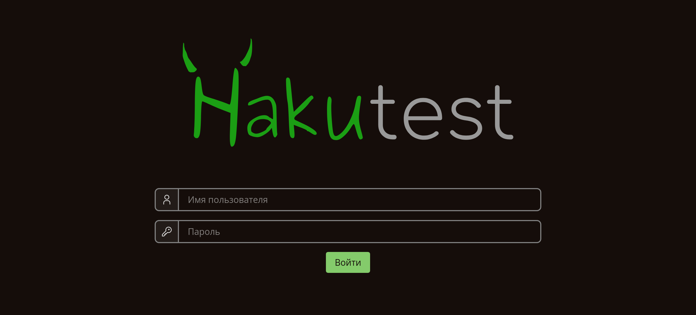
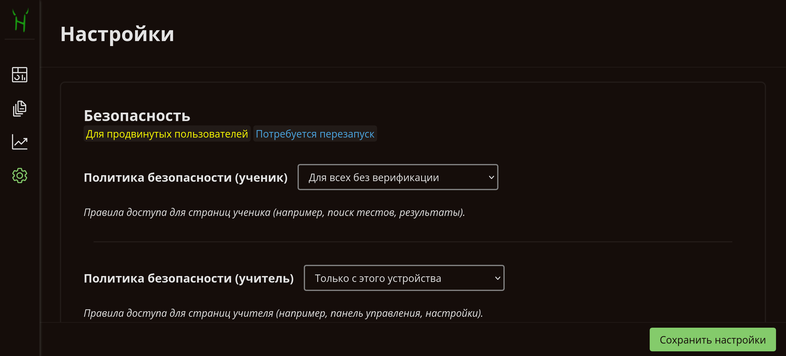

# Безопасность

---

> [!TIP] Вы узнаете:
>
> -   О модели и принципах безопасности Hakutest
> -   Как настраивать Hakutest с точки зрения безопасности

## Обзор

Безопасность &mdash; неотъемлемая часть Hakutest. Платформа реализует надежную модель
безопасности, оставляя при этом возможности для настройки.

## Модель безопасности

Модель безопасности Hakutest основана на ролях и политиках.

Роли определяют, какая страница или действие (маршрут) доступны определенному
пользователю. Каждый маршрут отмечен как доступный для определенного набора
ролей. По сути, [интерфейс ученика](/ru/handbook/guide/06-student-perspective)
доступен пользователям с ролью "ученик", а интерфейс учителя (такие страницы,
как [Панель управления](/ru/handbook/guide/02-dashboard), [Меню
тестов](/ru/handbook/guide/03-tests#tests-menu),
[Настройки](/ru/handbook/guide/05-settings) и т. д.) доступен пользователям с
ролью "учитель".

Политики определяют, подходит ли пользователь под ту или иную роль. Различные
политики могут применяться к разным ролям, причём к одной роли применяется одна
политика.

На данный момент Hakutest реализует 4 политики безопасности:

-   [Без верификации](#no-verification)
-   [Учётные данные](#credentials)
-   [Только это устройство](#hostonly)
-   [Прерывать все запросы](#abort-all)

### Для всех без верификации {#no-verification}

Позволяет кому угодно получить доступ к маршруту без дополнительной проверки.

> [!TIP] СОВЕТ
> По умолчанию эта политика применяется для **учеников**.

### По имени пользователя и паролю {#credentials}

Требуется авторизация пользователя путем ввода его учетных данных (имени
пользователя и пароля).

После успешной авторизации Hakutest запоминает пользователя, поэтому при
последующих запросах ввод учетных данных не требуется.

При использовании этой политики безопасности Hakutest'у необходимо хранить имена
пользователей и пароли в базе данных. В настоящее время платформа поддерживает
3 диалекта:

-   **SQLite** (по умолчанию) &mdash; учётные данные хранятся в локальном файле.
-   **MySQL**
-   **PostgreSQL**

Информацию о настройке хранения данных пользователей см. [ниже](#конфигурация).

> [!TIP] СОВЕТ
> Для управления пользователями вы можете использовать любую админ-панель,
> совместимую с используемой базой данных. Hakutest хранит данные пользователей
> в таблице `hakutest_users`.

### Только это устройство {#hostonly}

Доступ к маршруту возможен только с того же устройства, на котором работает
сервер (т.е. только с хоста). Это означает, что вы, как учитель, будете иметь
доступ, а ваши ученики &mdash; нет.

> [!TIP] СОВЕТ
> По умолчанию эта политика применяется для **учителя**.

### Прерывать все запросы {#abort-all}

Маршрут не может быть доступен никому с любого устройства. Все запросы
перенаправляются на страницу [поиска
тестов](/ru/handbook/guide/06-studentperspective#поиск-тестов).

> [!NOTE] К СВЕДЕНИЮ
> Эта политика безопасности может быть полезна, если Hakutest
> [запущен на сервере](/ru/handbook/advanced/03-on-server), а для управления
> тестами, экспорта статистики и проч. используется
> [`hakuctl`](/ru/handbook/advanced/04-hakuctl).

## Конфигурация

Хотя настройки безопасности Hakutest по умолчанию достаточно надежны, вы можете
изменить их в соответствии со своими потребностями. Например, вам может
понадобиться хранить данные пользователей в базе данных вашего учебного
заведения.

Настройки безопасности Hakutest можно изменить в
[Настройках](/ru/handbook/guide/05-settings).

| Параметр                            | Описание                                                                          | К сведению                                                                                                                     |
| ----------------------------------- | --------------------------------------------------------------------------------- | ------------------------------------------------------------------------------------------------------------------------------ |
| **Политика безопасности (ученик)**  | Политика безопасности, применяемая к интерфейсу ученика                           | &ndash;                                                                                                                        |
| **Политика безопасности (учитель)** | Политика безопасности, применяемая к интерфейсу учителя                           | &ndash;                                                                                                                        |
| **Диалект БД пользователей**        | Диалект базы данных, в которой хранится информация о пользователях                | &ndash;                                                                                                                        |
| **DSN БД пользователей**            | DSN (Data Source Name) базы данных, в которой хранится информация о пользователях | Для диалекта `SQLite` &mdash; путь к файлу базы данных.  Для диалектов `MySQL` и `PostgreSQL` &mdash; строка подключения |

> [!NOTE] К СВЕДЕНИЮ
> Все настройки безопасности требуют перезапуска для вступления в силу.

## Типичные ошибки

> [!CAUTION] ОСТОРОЖНО
> Ни в коем случае не делайте то, что описано ниже!

### Применение политики "Без верификации" к интерфейсу учителя

**Это очень опасно**. Это позволяет кому угодно получить доступ к интерфейсу
учителя: изменять настройки, удалять тесты и результаты и т. д.

### Применение политики "Только это устройство" к интерфейсу ученика

Это сделает Hakutest непригодным для использования, так как ученики не смогут
получить доступ к тестам.

### Применение политики "Прерывать все запросы" к интерфейсу ученика

Как и предыдущая ошибка, это не позволит ученикам получить доступ к тестам.

### Изменение диалекта без изменения DSN

Поскольку DSN зависит от используемой базы данных, необходимо изменить как сам
диалект, так и DSN. В противном случае Hakutest не сможет подключиться к базе
данных.
