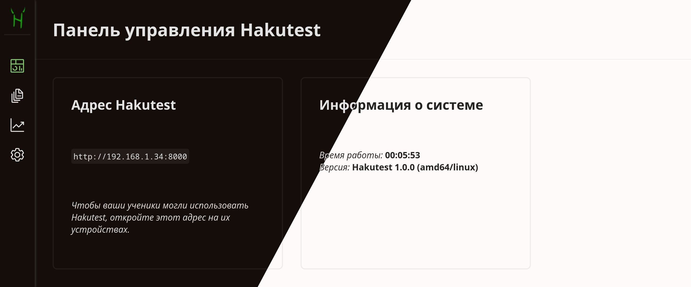

# Панель управления учителя

---

:::tip Вы узнаете:

-   Каковы возможности панели управления Hakutest
-   Как узнать информацию о сервере Hakutest

## :::

> [!TIP] СОВЕТ
> Hakutest автоматически переключается между светлой и темной темами в
> зависимости от настроек вашего браузера/операционной системы. В дальнейшем в
> руководстве будет использоваться тёмная тема.

## Обзор

Панель управления позволяет вам контролировать Hakutest прямо из браузера. Она
позволяет:

-   Смотреть информацию о Hakutest (см.
    [ниже](#главная-страница-панели-управления));
-   Управлять тестами, доступными для ваших учеников (см.
    [Тесты](/ru/handbook/guide/03-tests.md));
-   Управлять результатами ваших учеников и экспортировать статистику (см.
    [Результаты и статистика](/ru/handbook/guide/04-results-and-statistics.md));
-   Настраивать Hakutest (см. [Настройки](/ru/handbook/guide/05-settings.md)).

## Главная страница панели управления

На главной странице панели управления представлена информация о запущенном
сервере Hakutest.

### Адрес Hakutest

Hakutest автоматически определяет локальный IP-адрес вашего устройства. Ваши
ученики могут использовать его для доступа к Hakutest. Откройте этот адрес (в
нашем примере &mdash; `http://192.168.1.34:8000`) на устройствах ваших учеников, чтобы
они могли открывать тесты, отправлять решения и т.д.

> [!IMPORTANT] ВАЖНО
> По умолчанию панель управления можно открыть только с устройства, на котором
> запущен сервер. Мы рекомендуем проверить это, попробовав открыть страницу
> `/teacher/dashboard` с другого устройства. Например, если сервер доступен по
> адресу `http://192.168.1.34:8000`, откройте
> `http://192.168.1.34/teacher/dashboard` на другом устройстве. Вместо панели
> управления должен открыться [Поиск
> тестов](/ru/handbook/guide/06-student-interface#поиск-тестов).

<!-- TODO: link to the security settings page -->

### Информация о системе

В разделе "Информация о системе" вы можете посмотреть информацию о системе:

-   Версию Hakutest (включая операционную систему и архитектуру процессора);
-   Время работы сервера.
