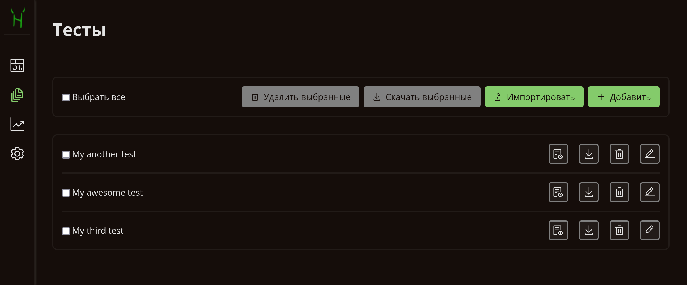
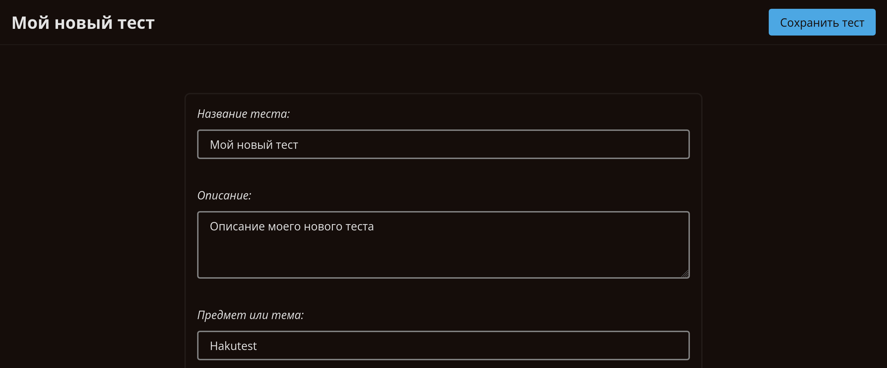
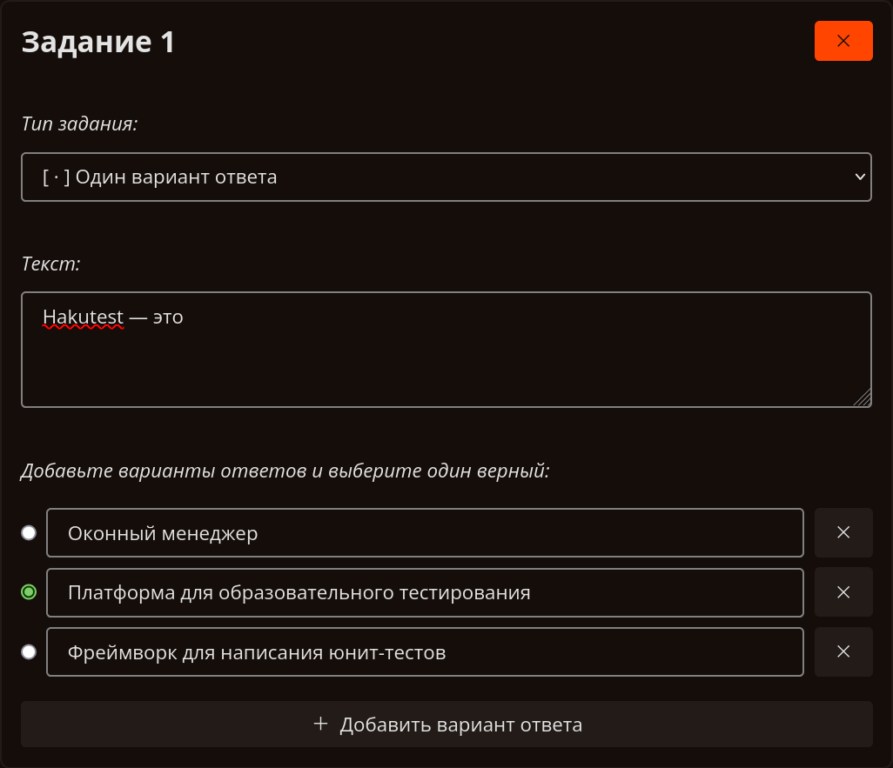
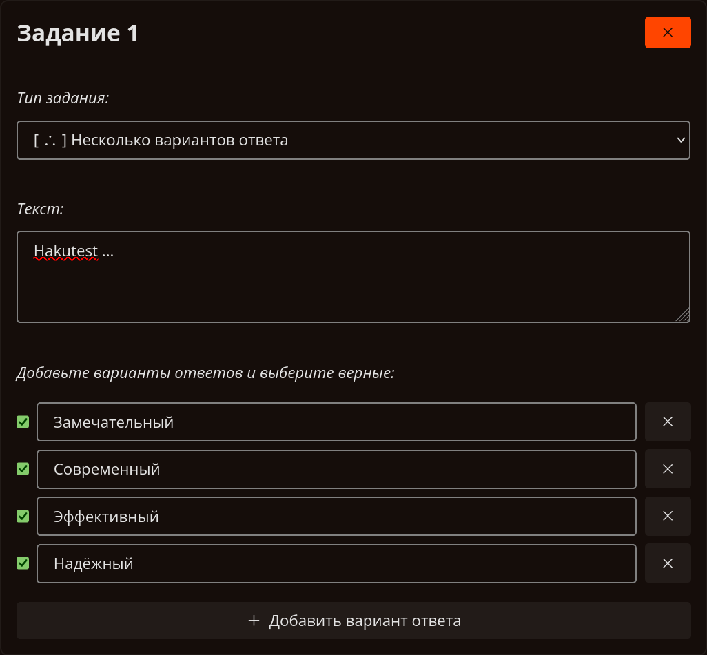
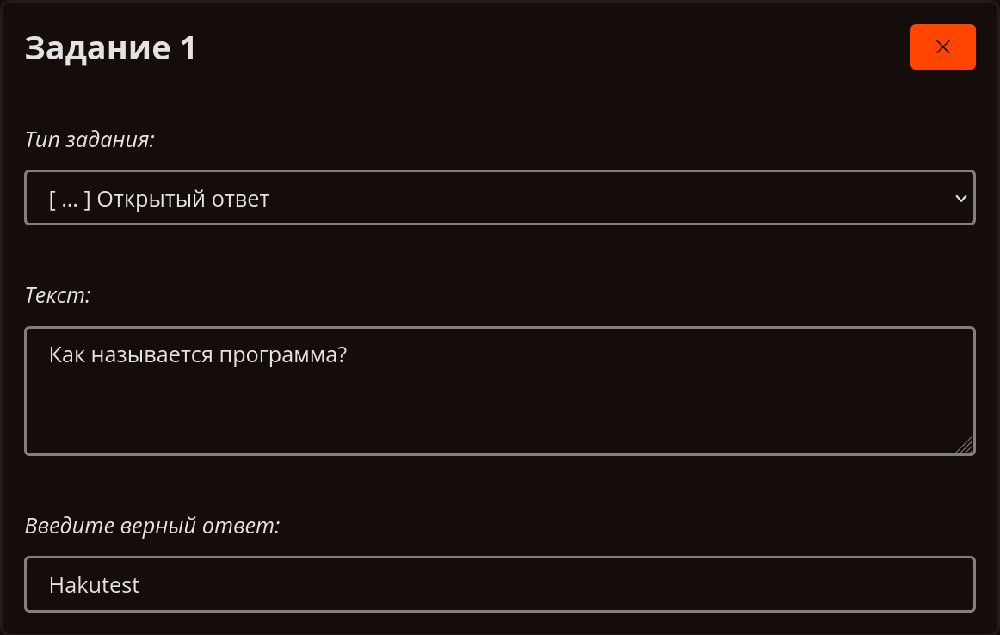
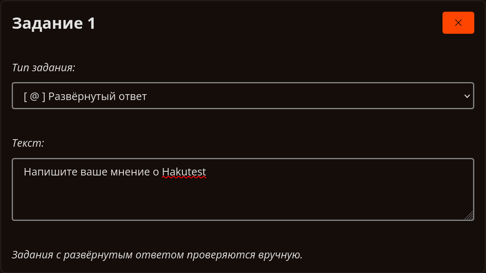

# Тесты

---

> [!TIP] Вы узнаете:
>
> -   Как управлять тестами, используя меню
> -   Как создавать и редактировать тесты с помощью редактора тестов Hakutest

## Обзор

Управление тестами &mdash; одна из важнейших функций Hakutest. Она позволяет
выполнять ряд операций с тестами, доступными вашим ученикам. Встроенный
редактор позволяет создавать целостные тесты, квизы, контрольные работы и
даже варианты экзаменов.

## Меню тестов



Меню тестов &mdash; это интерфейс, похожий на файловый менеджер, который позволяет вам управлять тестами.
Ниже описаны действия, которые вы можете выполнять в меню:

| Кнопка                                                                                         | Действие                                           |
| :--------------------------------------------------------------------------------------------- | :------------------------------------------------- |
| <button class="button button__primary"><i class="i add"></i> Добавить</button>                 | Создать новый тест в [редакторе](#редактор-тестов) |
| <button class="button button__primary"><i class="i import"></i> Импортировать</button>         | Импортировать тест из `.json` файла                |
| <button class="button button__danger"><i class="i trash-can"></i> Удалить выбранные</button>   | Удалить выбранные тесты                            |
| <button class="button button__secondary"><i class="i download"></i> Скачать выбранные</button> | Скачать выбранные тесты как `.zip` архив           |
| <button class="guide-action"><i class="i download"></i></button>                               | Скачать этот тест как `.json` файл                 |
| <button class="guide-action"><i class="i trash-can"></i></button>                              | Удалить этот тест                                  |
| <button class="guide-action"><i class="i edit"></i></button>                                   | [Редактировать](#редактор-тестов) этот тест        |
| <button class="guide-action"><i class="i view"></i></button>                                   | Предварительный просмотр этого теста               |

> [!TIP] СОВЕТ
> Импорт тестов из файлов JSON может быть полезен для обмена тестами между
> несколькими преподавателями. Загрузите тесты и отправьте их другому учителю
> для использования.

## Редактор тестов



Редактор тестов позволяет вам легко создавать и редактировать ваши тесты. Вам
нужно только заполнить [основные поля](#основные-поля), добавить
[задания](#задания) и [сохранить тест](#сохранение-теста).

### Основные поля

Основные поля описаны в таблице ниже:

| Поле                          | Описание                                                                         | Пример                       |
| :---------------------------- | :------------------------------------------------------------------------------- | :--------------------------- |
| **Название** (_обязательное_) | Это поле отображается в меню и используется для поиска тестов                    | _Мой тест_                   |
| **Описание**                  | Описание теста                                                                   | _Пробный ОГЭ по информатике_ |
| **Предмет**                   | Предмет или тема теста                                                           | _Информатика и ИКТ_          |
| **Автор**                     | Автор теста                                                                      | _Иван Иванов_                |
| **Целевая аудитория**         | Для кого предназначен тест                                                       | _Ученики 9-х классов_        |
| **Учебное заведение**         | Учебное заведение, в котором проводится тестирование                             | _Академия Hakutest_          |
| **Доступен до**               | Время истечения срока действия теста. Оставьте пустым, чтобы тест был бессрочным | _06/28/2032 08:00 PM_        |

### Задания

Каждое задание содержит следующую информацию:

-   [Тип задания](#типы-заданий);
-   [Текст задания](#текст-задания);
-   [Варианты ответов и правильный ответ](#типы-заданий) (зависят от типа задания).

### Текст задания

Текст задания &mdash; это, как правило, его условия. Вы можете использовать
[Markdown-разметку](https://ru.wikipedia.org/wiki/Markdown) в тексте. Ниже
приведены примеры текстов заданий:

:::details Стили текста

<!-- prettier-ignore-start -->
```markdown
*курсив*

**жирный**

***жирный и курсив***

~~зачёркнутый~~

`моноширинный`

> Цитирование
```
<!-- prettier-ignore-end -->

---

_курсив_

**жирный**

**_жирный и курсив_**

~~зачёркнутый~~

`моноширинный`

> Цитирование

:::

:::details Заголовки

```markdown
### Моё замечательное задание

Lorem ipsum dolor sit amet.
```

---

### Моё замечательное задание

Lorem ipsum dolor sit amet.

:::

:::details Подстрочный и надстрочный индекс

```markdown
Каждый программист знает, что 2^10^ равно 1024.

Оставайтесь увлажненными! Пейте больше H~2~O!
```

---

Каждый программист знает, что 2<sup>10</sup> равно 1024.

Оставайтесь увлажненными! Пейте больше H<sub>2</sub>O!

:::

:::details Ссылки и изображения

```markdown
[Hakutest](https://hakutest.org)


```

---

[Hakutest](https://hakutest.org)


:::

:::details Таблицы и списки

```markdown
|  #  | Товар                               |   Цена |
| :-: | :---------------------------------- | -----: |
|  1  | Коробка с карандашами x150          |  2000₽ |
|  2  | Коробка с цветными карандашами x150 | 12000₽ |

Нумерованый список:

1. Элемент 1
2. Элемент 2
3. Элемент 3

Маркированый список:

-   Элемент
-   Другой элемент
-   Третий элемент
```

---

|  #  | Товар                               |   Цена |
| :-: | :---------------------------------- | -----: |
|  1  | Коробка с карандашами x150          |  2000₽ |
|  2  | Коробка с цветными карандашами x150 | 12000₽ |

Нумерованый список:

1. Элемент 1
2. Элемент 2
3. Элемент 3

Маркированый список:

-   Элемент
-   Другой элемент
-   Третий элемент

:::

> [!TIP] Горячие клавиши
> Редактор тестов Hakutest поддерживает ряд горячих клавиш, которые могут быть
> полезны для увеличения скорости работы.
>
> | Горячие клавиши | Вставляемая разметка |
> | :-------------: | -------------------- |
> |    `Ctrl+B`     | **Жирный**           |
> |    `Ctrl+I`     | _Курсив_             |
> |    `Ctrl+K`     | [Ссылка](#)          |
> | `Ctrl+Shift+X`  | ~~Зачёркнутый~~      |
> | `Ctrl+Shift+M`  | `Моноширинный`       |

#### Типы заданий

В Hakutest есть 4 типа заданий:

-   **Один вариант ответа** &mdash; Ученик должен выбрать один вариант ответа;
-   **Несколько вариантов ответа** &mdash; Ученик должен выбрать несколько
    вариантов ответа;
-   **Открытый ответ** &mdash; Ученик должен ввести короткий ответ;
-   **Развёрнутый** &mdash; Ученик должен ввести развёрнутый ответ.

> [!IMPORTANT] ВАЖНО
>
> Задания с **одним вариантом ответа**, **несколькими вариантами ответа** и с
> **открытым ответом** проверяются Hakutest'ом автоматически. Вы выбираете (или
> вводите) правильный ответ или ответы, и Hakutest проверяет их.
>
> Задания с **развёрнутым ответом** проверяются учителем вручную. Во время
> проверки Hakutest отметить непустые ответы как верные, пустые &mdash; как
> неверные.

Ниже приведены примеры для каждого типа задания:

:::details Один вариант ответа



:::

:::details Несколько вариантов ответа



:::

:::details Открытый ответ

> [!NOTE] К СВЕДЕНИЮ
> Регистр не влияет на правильность ответа.



:::

:::details Развёрнутый ответ



:::

### Сохранение теста

Когда вы закончите редактирование теста, нажмите кнопку "Сохранить тест".
Hakutest автоматически сохранит тест, после чего он станет доступен вашим
ученикам.

<button class="button button__secondary">Сохранить тест</button>
