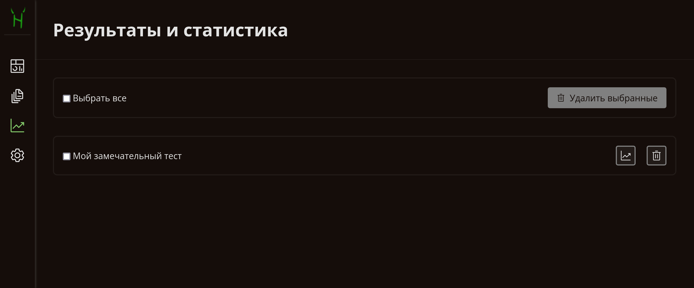
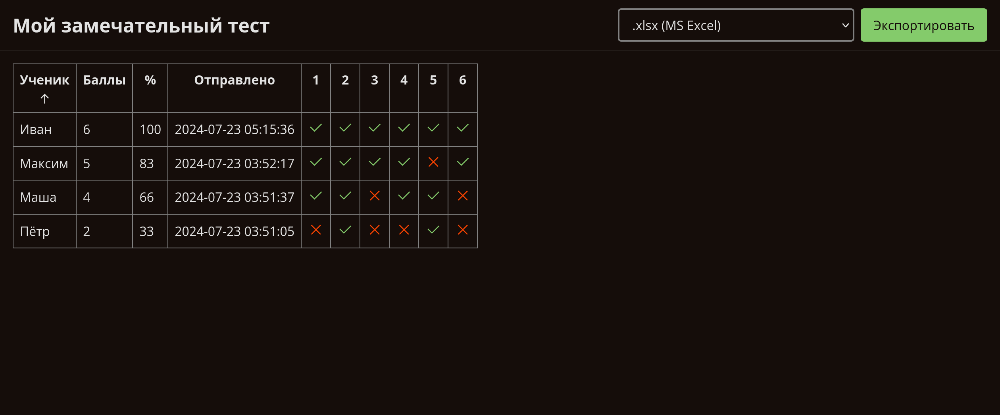
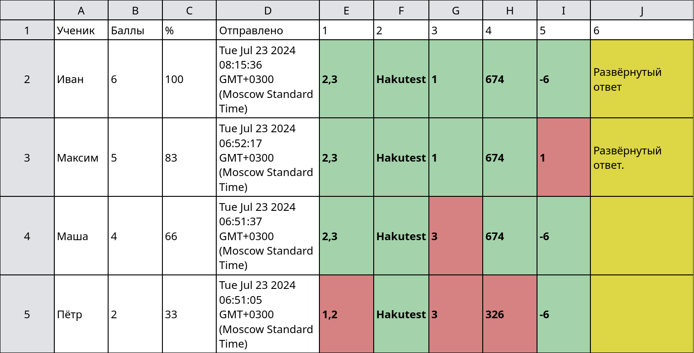

# Результаты и статистика

---

> [!TIP] Вы узнаете:
>
> -   Как управлять результатами учеников с помощью меню
> -   Как генерировать статистику результатов
> -   Как экспортировать статистику в поддерживаемые форматы

## Обзор

Управление результатами &mdash; одна из ключевых функций Hakutest, предлагающая
гибкие возможности для эффективного отслеживания и контроля прогресса ваших
учеников. С помощью этой функции вы сможете получить ценную информацию об
успеваемости своих учеников, что позволит вам определить области, в которых они
преуспевают или испытывают трудности.

## Меню результатов



Меню результатов &mdash; это интерфейс, похожий на файловый менеджер, который
позволяет управлять результатами ваших учеников. Каждая запись представляет
собой набор результатов по данному тесту. В следующей таблице описаны действия,
которые можно выполнять в меню:

| Кнопка                                                                                       | Действие                                                             |
| -------------------------------------------------------------------------------------------- | -------------------------------------------------------------------- |
| <button class="button button__danger"><i class="i trash-can"></i> Удалить выбранные</button> | Удалить выбранные результаты                                         |
| <button class="guide-action"><i class="i trash-can"></i></button>                            | Удалить результаты этого теста                                       |
| <button class="guide-action"><i class="i analytics"></i></button>                            | Сгенерировать [статистику](#статистика) для этого набора результатов |

## Статистика

Вы можете сгенерировать статистику результатов для каждого теста, нажав на
кнопку, как описано выше. Hakutest сгенерирует аналогичную страницу для
заданного набора результатов:



Результаты можно сортировать по любому из отображаемых столбцов:

-   По имени ученика;
-   По набранным баллам;
-   По набранному проценту;
-   По времени сдачи;
-   По правильности каждого ответа в тесте.

Нажмите на заголовок столбца, чтобы применить условие сортировки. Нажмите ещё
раз, чтобы развернуть порядок.

> [!TIP] СОВЕТ
> Наведите курсор на ячейки с ответами, чтобы увидеть ответы ученика.

## Экспорт статистики

Вам может понадобиться экспортировать статистику в удобный формат, чтобы
выполнить дополнительные операции или создать отчет. Hakutest поддерживает
следующие форматы экспорта:

-   **XLSX** (Microsoft Excel®) &mdash; рекомендован для большинства пользователей;
-   **JSON**;
-   **CSV**.

Чтобы экспортировать статистику:

1. Выберите формат;
2. Нажмите на кнопку "Экспортировать".

<button class="button button__primary">Экспортировать</button>

---

Будет загружена статистика в выбранном формате. Ниже приведены примеры для
каждого поддерживаемого формата:

:::details XLSX

> [!TIP] СОВЕТ
>
> <b :class="$style.correct">Зелёные</b> ячейки обозначают правильные ответы.
>
> <b :class="$style.incorrect">Красные</b> ячейки обозначают неправильные ответы.
>
> <b :class="$style.detailed">Жёлтые</b> ячейки обозначают развёрнутые ответы, которые требуют ручной проверки.
>
> ---
>
> **Форматирование может отличаться в зависимости от табличного процессора.**



:::

:::details JSON

> [!IMPORTANT] ВАЖНО
> Ответы в JSON индексируются с нуля, то есть первый вариант обозначен как 0,
> второй &mdash; 1 и т. д.
>
> Например, ответ `2` в экспортированном JSON-файле означает, что ученик выбрал
> вариант 3.

```json
[
    {
        "student": "Маша",
        "submitted_at": "2024-07-23T03:51:37.179852518+03:00",
        "answers": [
            {
                "type": "multiple",
                "value": "1,2",
                "correct": true
            },
            {
                "type": "open",
                "value": "Hakutest",
                "correct": true
            },
            {
                "type": "single",
                "value": "2",
                "correct": false
            },
            {
                "type": "open",
                "value": "674",
                "correct": true
            },
            {
                "type": "open",
                "value": "-6",
                "correct": true
            },
            {
                "type": "detailed",
                "value": "",
                "correct": false
            }
        ],
        "percentage": 66,
        "points": 4,
        "total": 6
    },
    {
        "student": "Максим",
        "submitted_at": "2024-07-23T03:52:17.758674112+03:00",
        "answers": [
            {
                "type": "multiple",
                "value": "1,2",
                "correct": true
            },
            {
                "type": "open",
                "value": "Hakutest",
                "correct": true
            },
            {
                "type": "single",
                "value": "0",
                "correct": true
            },
            {
                "type": "open",
                "value": "674",
                "correct": true
            },
            {
                "type": "open",
                "value": "1",
                "correct": false
            },
            {
                "type": "detailed",
                "value": "Развёрнутый ответ.",
                "correct": true
            }
        ],
        "percentage": 83,
        "points": 5,
        "total": 6
    }
]
```

:::

:::details CSV

> [!IMPORTANT] ВАЖНО
> Ответы в CSV индексируются с нуля, то есть первый вариант обозначен как 0,
> второй &mdash; 1 и т. д.
>
> Например, ответ `1,2` в экспортированном CSV-файле означает, что ученик
> выбрал варианты 2 и 3.

```csv
Маша,4,66,2024-07-23 03:51:37,"1,2",Hakutest,2,674,-6,
Пётр,2,33,2024-07-23 03:51:05,"0,1",Hakutest,2,326,-6,
Максим,5,83,2024-07-23 03:52:17,"1,2",Hakutest,0,674,1,Развёрнутый ответ.
```

:::

<style module>
.correct {
    padding: 4px;
    background: #A4D2AA;
    color: #2C7135;
}

.incorrect {
    padding: 4px;
    background: #D68282;
    color: #870E0F;
}

.detailed {
    padding: 4px;
    background: #DDD645;
    color: #38201D;
}
</style>
