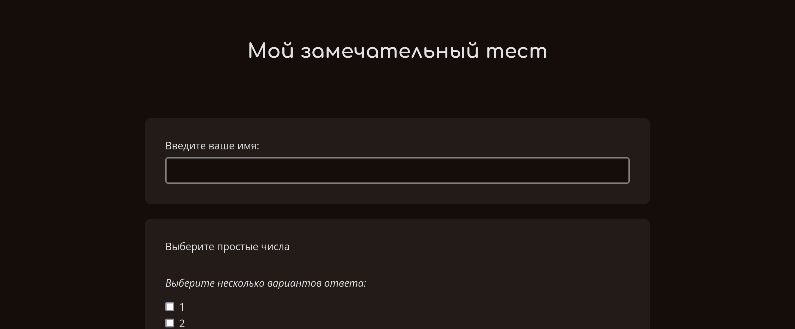
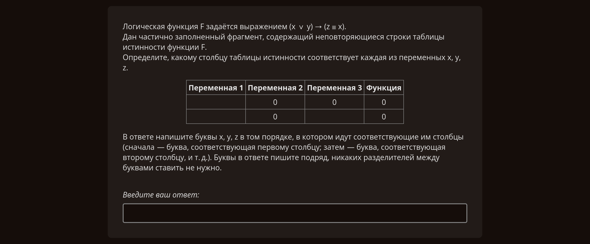
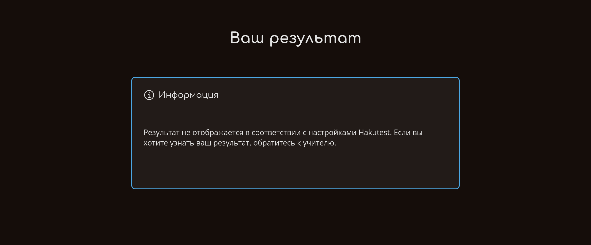

# С точки зрения ученика

---

> [!TIP] Вы узнаете:
>
> -   Как ученики используют Hakutest

На данный момент мы полностью рассмотрели опыт использования Hakutest'а
учителем. Давайте кратко подведем итоги того, что вы узнали:

-   Запуск и остановка [Сервера Hakutest](/ru/handbook/guide/01-server);
-   Мониторинг состояния сервера с помощью [Панели управления](/ru/handbook/guide/02-dashboard);
-   Управление [тестами](/ru/handbook/guide/03-tests);
-   Управление [результатами и статистикой](/ru/handbook/guide/04-results-and-statistics);
-   [Настройка Hakutest](/ru/handbook/guide/05-settings).

Однако стоит рассмотреть и другую точку зрения &mdash; как ученик использует Hakutest.

## Поиск тестов

Страница поиска тестов &mdash; это главная страница интерфейса ученика.

На этой странице ученик может быстро открывать тесты. При наборе текста в
поисковой строке Hakutest сразу предложит доступные тесты. Ученик может выбрать
нужный тест и нажать Enter &mdash; откроется страница с тестом.

## Страница теста

Страница теста позволяет ученику решать тест и отправлять свои ответы.

Как уже упоминалось в главе [Тесты](/ru/handbook/guide/03-tests#текст-задания),
текст задачи может содержать разметку Markdown. Ниже приведен пример того, как
текст будет виден ученику.

Когда ученик закончит решать тест, он должен нажать на кнопку "Отправить" в нижней части страницы.

<button class="button button__primary">Отправить</button>

## Отправка ответов

Когда ученик отправляет ответы, Hakutest ведет себя по-разному в зависимости от
[настроек](/ru/handbook/guide/05-settings#основная-конфигурация).

### Перезапись результатов

> [!TIP] СОВЕТ
> По умолчанию, эта опция **отключена**.

Если опция "Перезаписывать результаты" включена, Hakutest перезапишет результат
этого ученика, если он существует. Ниже приведен пример сценария:

1. Ученик отправляет ответы впервые;
2. Hakutest сохраняет отправленные ответы;
3. Ученик переходит на страницу теста и снова отправляет ответы;
4. Hakutest перезаписывает существующий результат, так что результаты первой
   отправки больше не доступны.

### Показ результатов

> [!TIP] СОВЕТ
> По умолчанию, эта опция **включена**.

Если опция "Показывать результаты" включена, Hakutest сразу же покажет
результат ученику:

В противном случае отображается информационное сообщение:

> [!TIP] Поздравляем 🎉
> Вы успешно дошли до этого момента, что означает, что вы освоили Hakutest на
> уровне пользователя! Ваш текущий уровень знаний достаточен для полноценной
> работы с платформой. Конечно, вы всегда можете вернуться к руководству, чтобы
> найти ответ на вопрос или вспомнить ту или иную инструкцию.
>
> ---
>
> _При желании, вы можете изучать Hakutest на более продвинутом уровне. Чтобы
> начать, нажмите на кнопку "Следующая страница" ниже_.
