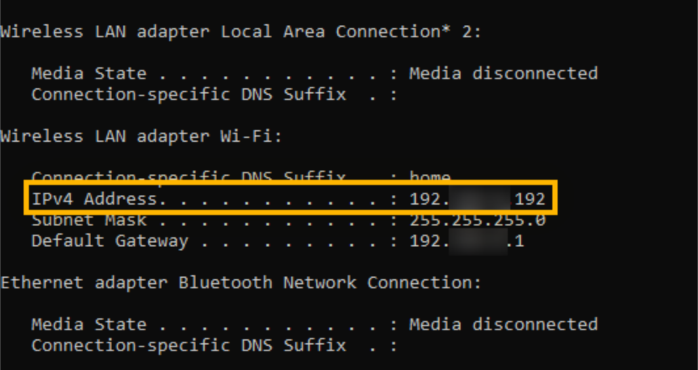

# Определение локального IP-адреса вручную

Хотя [Панель управления Hakutest](/ru/handbook/guide/02-dashboard) способна
определить локальный IP-адрес вашего устройства, иногда она может определить
его неверно. В этом случае ваши ученики не смогут получить доступ к Hakutest по
предложенному адресу.

Вам нужно будет узнать локальный IP вашего устройства и открыть соответствующий
адрес на устройствах учеников. Ниже приведены инструкции по определению
локального IP-адреса вручную.

## Определение IP-адреса

### Windows

#### Способ 1: Через Настройки

1. Откройте **Настройки**;
2. Выберите **Сеть и Интернет**;
3. Выберите **Wi-Fi** в панели слева и нажмите **Продвинутые настройки** (для
   проводных подключений, выберите **Ethernet** и затем нажмите **Подключения к
   сети**);
4. Посмотрите свой локальный IP-адрес в поле **IPv4-адрес**.

#### Способ 2: Через Командную строку

1. Нажмите <kbd>Win+R</kbd>;
2. В поле ввода введите "cmd" и нажмите <kbd>Enter</kbd>;
3. В Командной строке введите `ipconfig` и нажмите <kbd>Enter</kbd>;
4. Пролистайте до поля **IPv4-адрес**, чтобы узнать ваш локальный IP.



### Linux

Запустите следующую команду в оболочке командной строки (терминале):

```shell
ip -o route get to 8.8.8.8 | sed -n 's/.*src \([0-9.]\+\).*/\1/p'
```

Пример вывода:

```
192.168.1.34
```

В качестве альтернативы, вы можете узнать ваш локальный IP-адрес через
настройки вашей системы, в зависимости от окружения рабочего стола, которое вы
используете.

## Что делать после определения локального IP-адреса

Когда вы вручную определите локальный IP-адрес своего устройства, откройте его
на устройствах ваших учеников. Рассмотрим пример:

-   Ваш локальный IP-адрес &mdash; `10.0.0.8`;
-   Hakutest работает на порту `8080` (который используется по умолчанию);

В этом случае откройте адрес `http://10.0.0.8:8080` на другом устройстве.
Должна открыться страница [поиска тестов](/ru/handbook/guide/06-student-perspective#поиск-тестов).

> [!IMPORTANT] ВАЖНО
> Ваше устройство и устройство вашего ученика должны быть подключены к одной
> сети.
