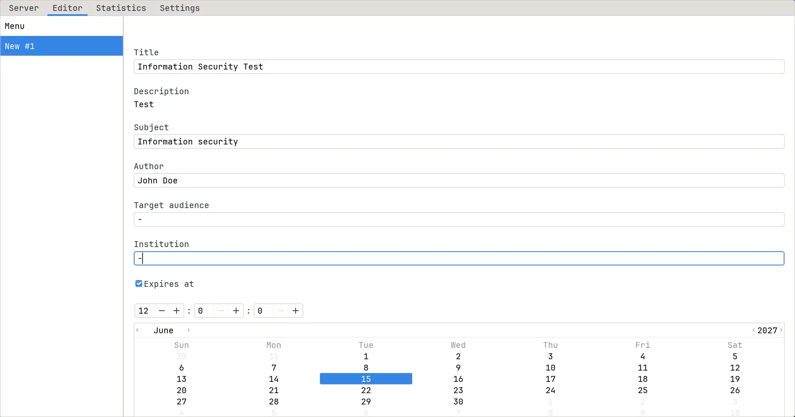

import Tabs from '@theme/Tabs'
import TabItem from '@theme/TabItem'

# Hakutest GUI

Hakutest provides an easy-to-use graphical app. It includes features for
creating and editing tests, an interactive menu for exporting statistics, and
application settings.

<Tabs>
    <TabItem value="windows" label="Windows" default>
        On Windows, Hakutest uses the graphical application by default. To use
        it, run `hakutest.exe`.
    </TabItem>
    <TabItem value="linux" label="Linux">
        On Linux, Hakutest provides both a graphical interface and a
        [CLI application](/docs/cli/about). Run `hakutest-gtk` to launch the
        graphical app.
    </TabItem>
    <TabItem value="macos" label="macOS">
        Currently, graphical app is not available for macOS. We are working on
        it.
    </TabItem>
</Tabs>

:::tip

Hereinafter screenshots use the GTK `Adwaita` theme. If you want to change the
appearance of the application, see [Customizing appearance of the graphical
app](/docs/advanced/appearance/gui).

:::
