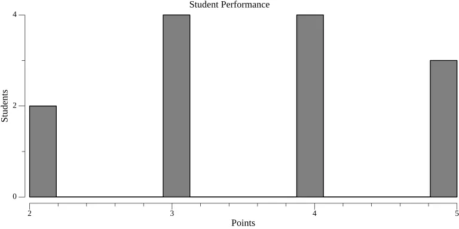

# Histogram

Student test results can be exported to a histogram via two methods:

-   [Via graphical app](/docs/gui/statistics) (recommended).
-   [Using the `hakutest statistics` command](/docs/cli/statistics).

## Data format

Test results statistics is exported as a PNG image with histogram as follows:

-   The horizontal axis indicates the number of points scored by students.
-   The vertical axis indicates the quantity of students who scored this number of points.
