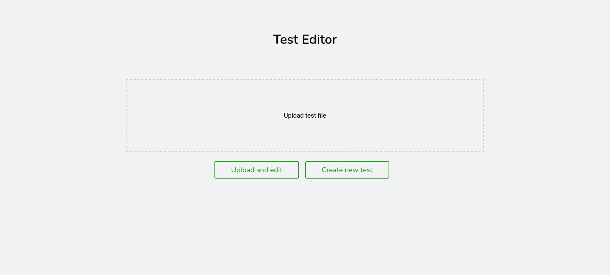
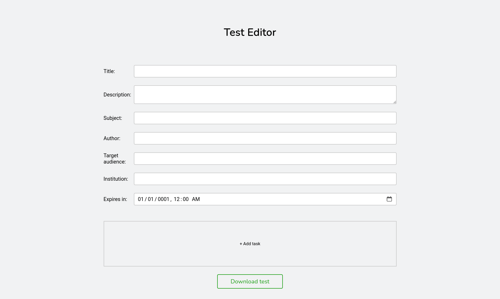
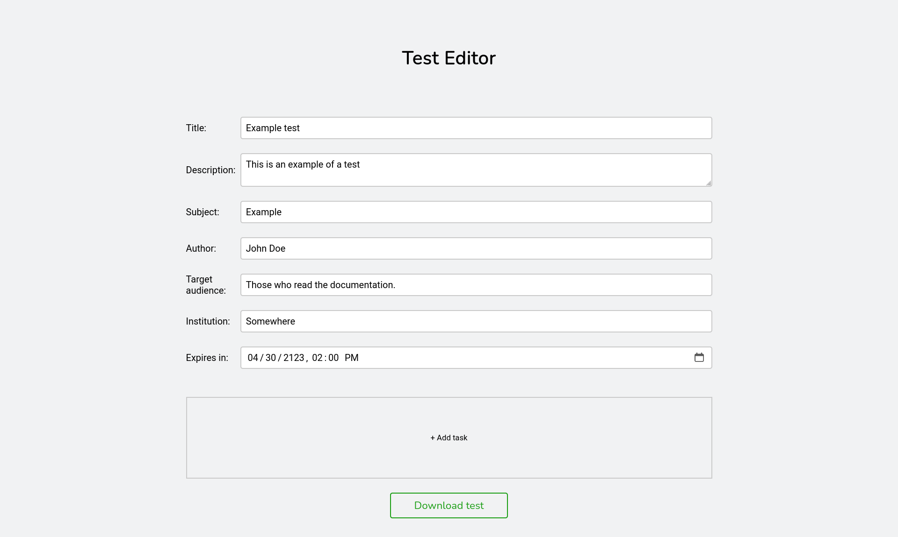
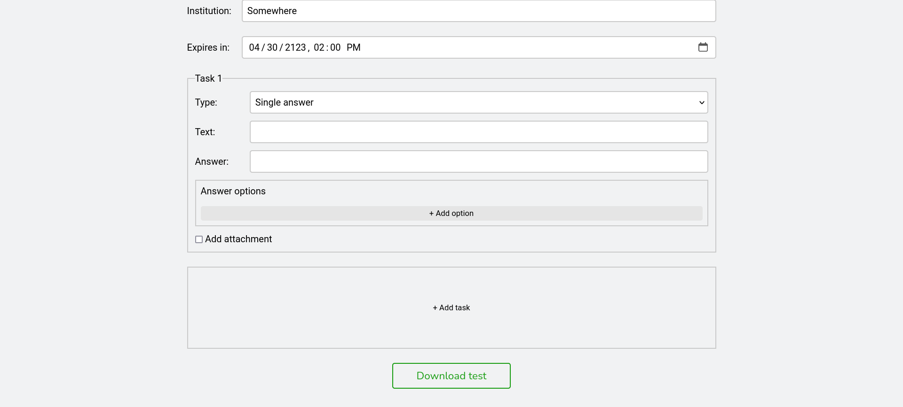
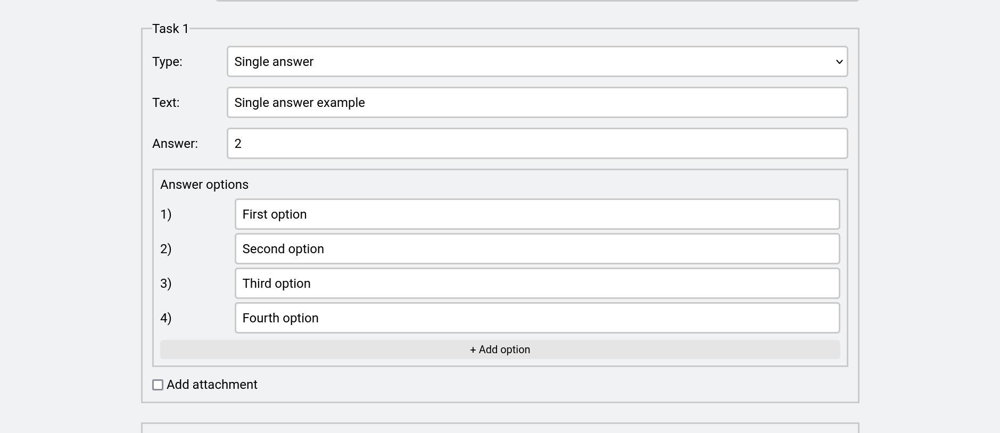
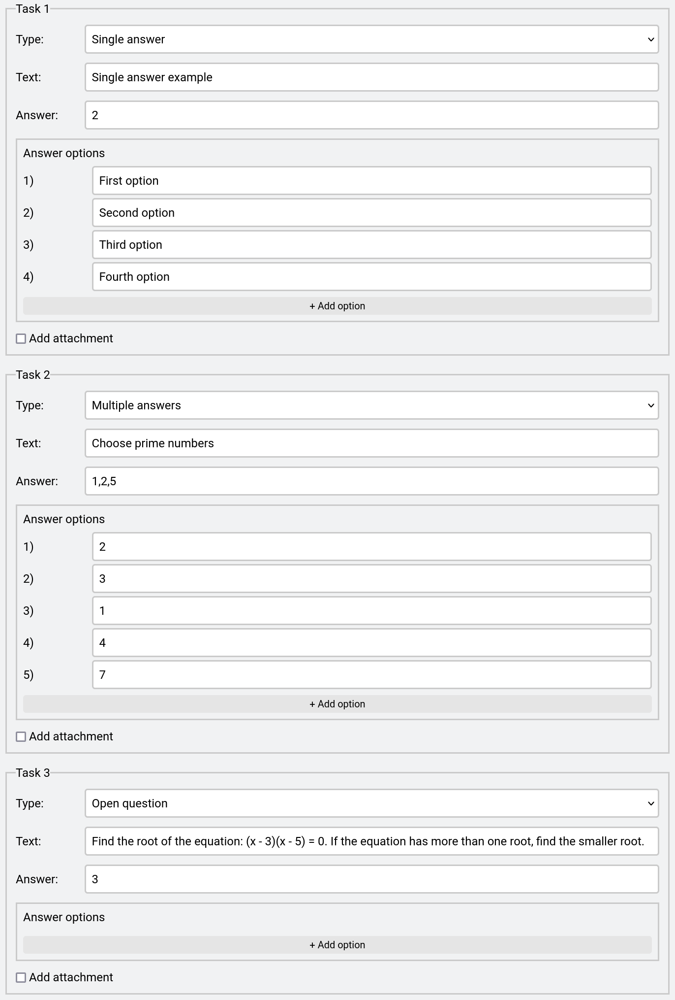
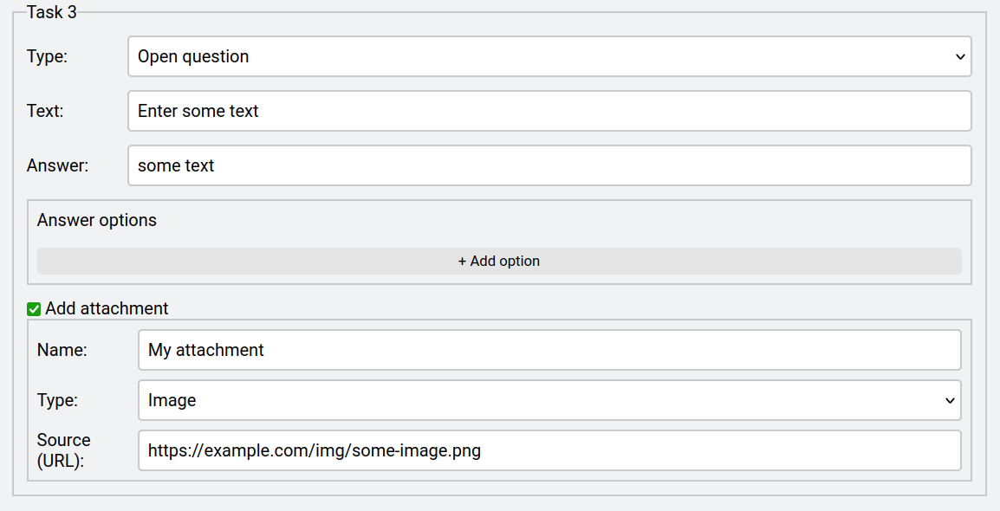

# Test editor

Test editor allows to create and edit tests.

When the server is running, it can be accessed at the following URL:

`http://localhost:<port>/editor/upload`

Where `port` is the port on which server is listening.

Default test editor URL is http://localhost:8080/editor/upload.

## Using the editor

:::tip

For more information about test structure, it is recommended to read [Tests guide](/docs/guide/tests).

:::

### Create new test

To create new test, click "Create new test" button.

### Edit existing test

To edit existing test file, follow the instruction:

1.  Upload test file that you want to edit by clicking on "Upload test file".
2.  Click "Edit test" button.

### Editor

Once you have selected one of the options, an editor page will open where you can edit the test by filling in the required fields:

:::tip

To create a test with no expiry time, leave the field "Expires in" unchanged or empty.

:::

### Adding tasks

To add a task, click the "+ Add task" button:

Here is the example for other types of tasks:

### Adding attachment

You can also add an attachment to the task by ticking the checkbox "Add attachment":

### Download the test

Once you have finished editing the test, download it by clicking "Download test" button.

To have access to the created test, don't forget to move it to the tests folder.
