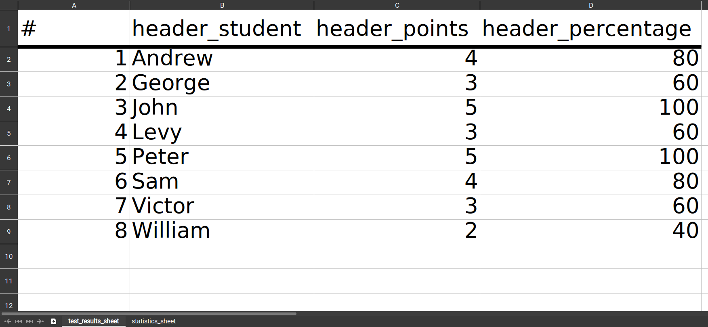
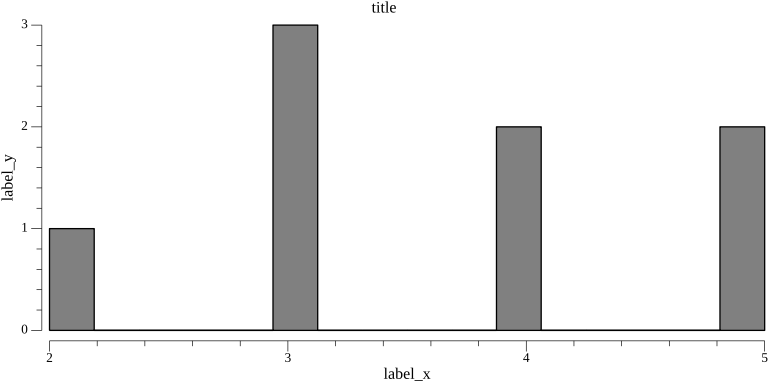

# Statistics

Hakutest settings for exporting student results and statistics. Specified under the `stats` field in the config file.

## Fields

### `excel`

Specifies the settings for exporting results to an Excel document.

**Options**:

-   `test_results_sheet` - Name of sheet with students' results.
-   `statistics_sheet` - Name of sheet with test statistics.
-   `header_student` - Header for the column with student names.
-   `header_points` - Header for the column with points scored by students.
-   `header_percentage` - Header for the column with percentage of correct answers.

**Visual example**:



### `image`

Specifies the settings for exporting results to a PNG histogram.

**Options**:

-   `title` - Title of the histogram.
-   `label_x` - Label for histogram x-axis (Points).
-   `label_y` - Label for histogram y-axis (Students).

**Visual example**:



## Example

Example of statistics configuration:

```yaml title='config.yaml'
stats:
    excel:
        test_results_sheet: Test Results
        statistics_sheet: Test Statistics
        header_student: Student
        header_points: Points
        header_percentage: '%'
    image:
        title: Student Performance
        label_x: Points
        label_y: Students
# Other fields...
```
