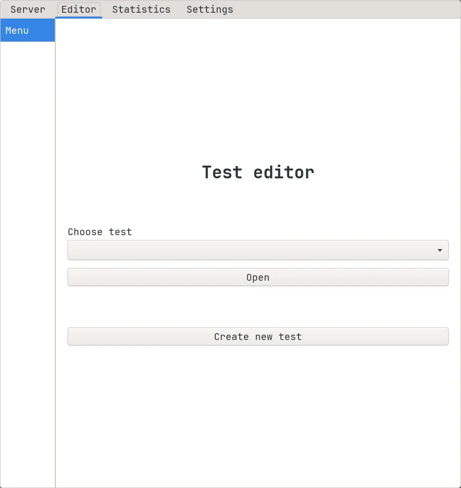
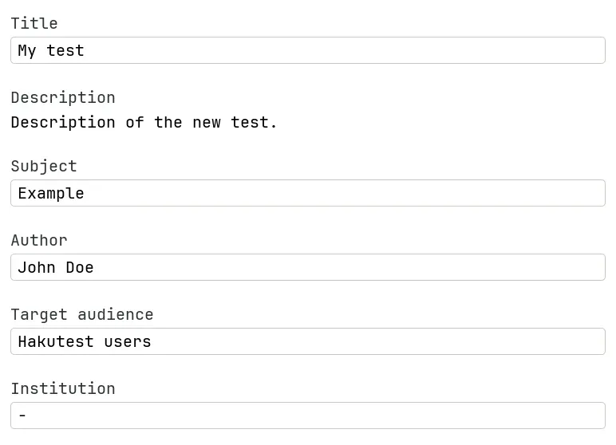
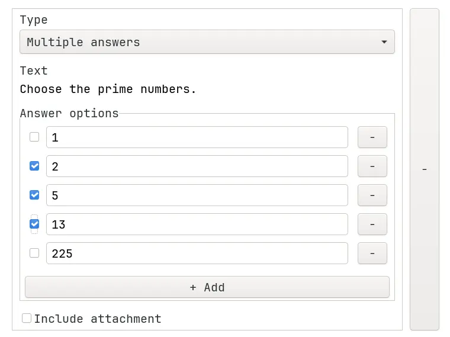
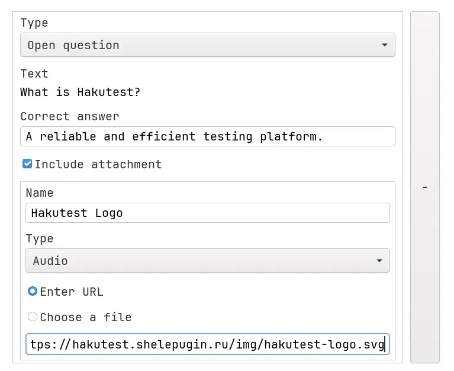

# Test editor

Hakutest provides a powerful and convenient graphical test editor. It allows to
create new tests and modify the existing ones.

To use the test editor, follow the instruction below:

1.  Go to the "Editor" tab:

2.  Select a test and press the "Open" button or press "Create new test" button.

3.  Fill the common fields:

4.  Add tasks to your test:

5.  When you have finished editing the test, press the "Save test" button.
    Hakutest will automatically save your test to the tests directory, so that
    it will be available to your students.

:::tip

To learn more about tests, see [Tests](/docs/guide/tests).

:::
