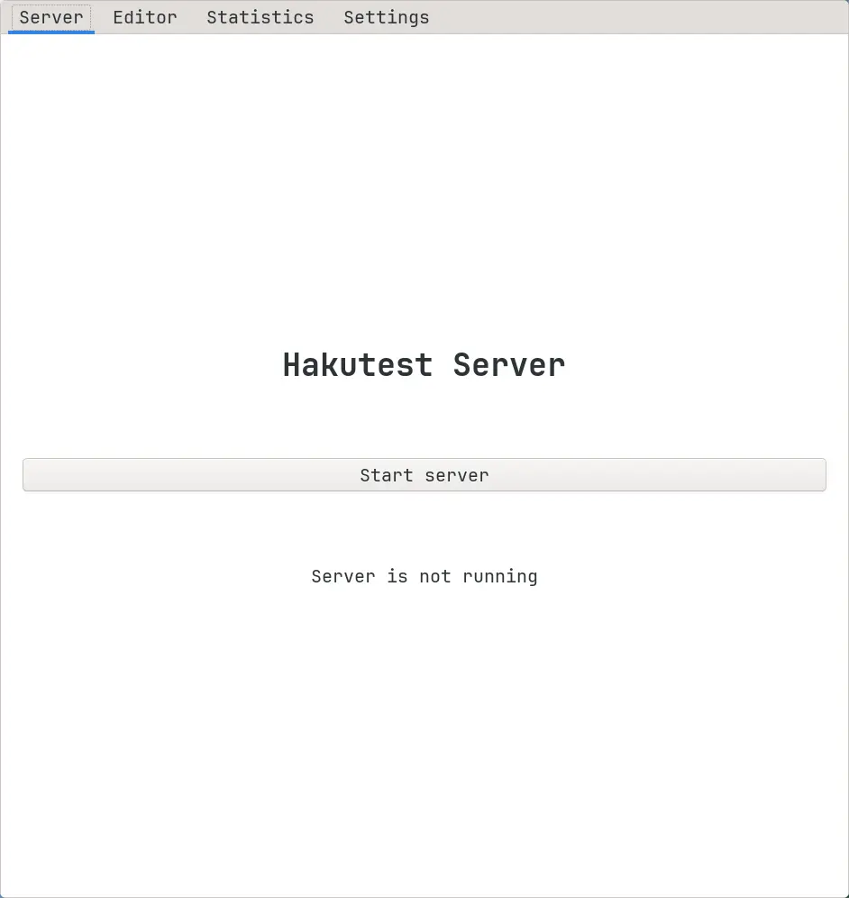
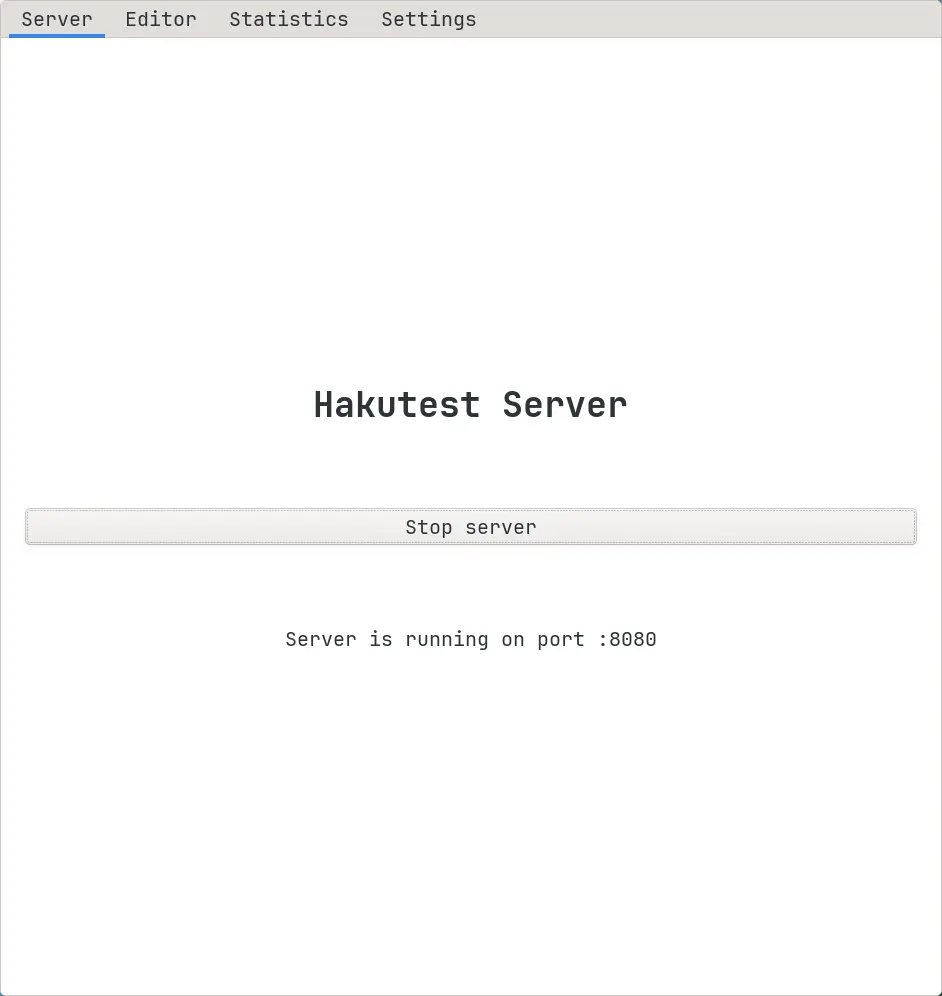

# Controlling the server via graphical app.

To manage the Hakutest server using the app, follow the instructions below:

1.  Go to the "Server" tab:

2.  To start the server, press the "Start server" button:

3.  To stop the server, press the button again.
