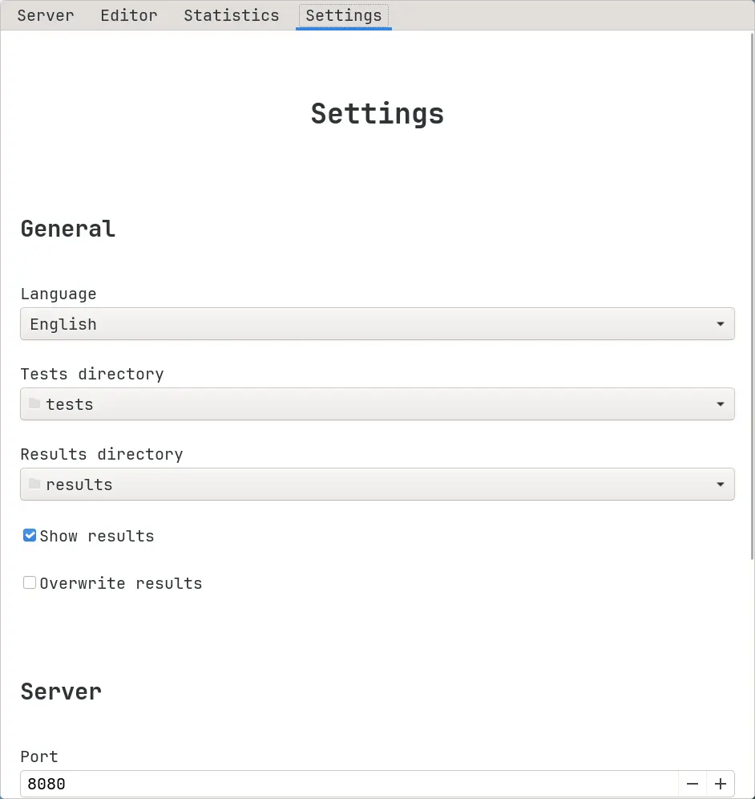

# Managing configuration via graphical app

You can configure Hakutest using the graphical app:

1.  Go to the "Settings" tab:

2.  Configure Hakutest as you need it.

3.  Press the "Save" button to save settings.

:::tip

To learn more about Hakutest configuration, see
[Configuration](/docs/category/configuration).

:::
