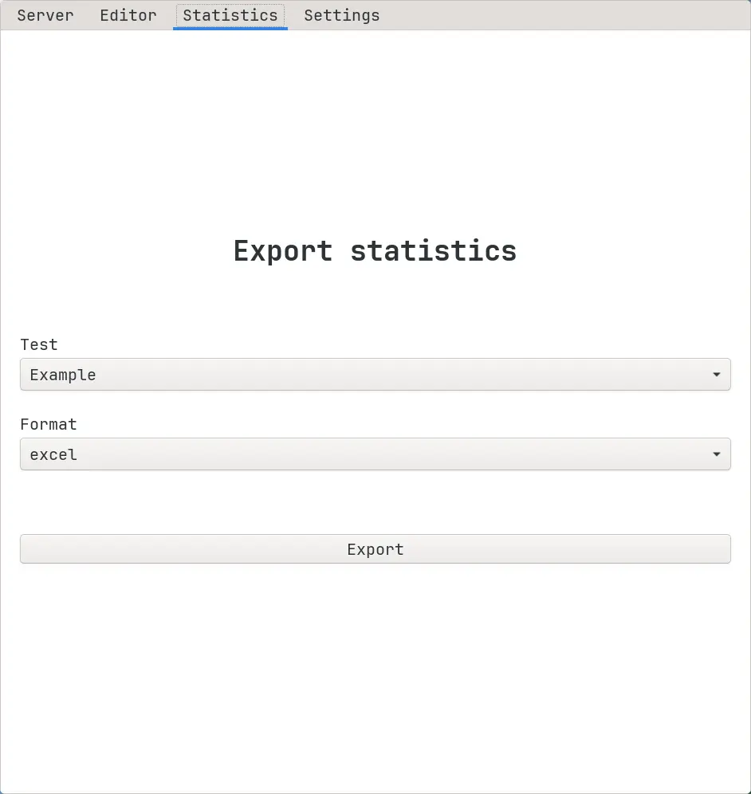

# Exporting statistics via graphical app.

To export test statistics using the app, follow the instructions below:

1.  Go to the "Statistics" tab:

2.  Choose the test and the format.
3.  Press the "Export" button.

Statistics of the selected test will be exported to "Downloads".

:::tip

To learn more about test statistics, see [Statistics](/docs/statistics/about).

:::
