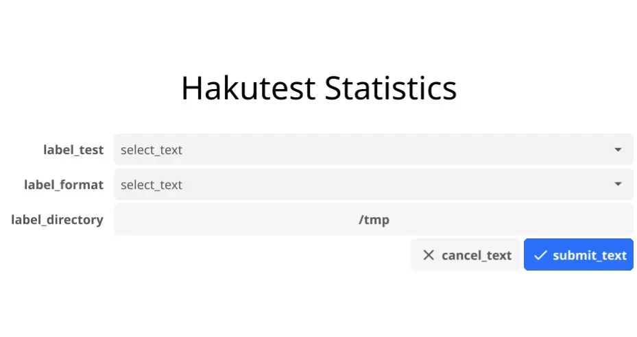
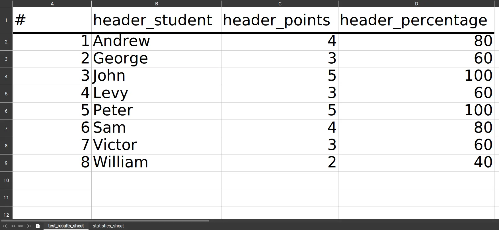

# Statistics

Hakutest internationalization for exporting student results and statistics. Specified under the `stats` field in the internationalization file.

## Fields

### `app`

Specified the internationalization for the interface of `hakutest-statistics` executable.

**Options**

- `label_test`: Label of the test selection field.
- `label_format`: Label of the format selection field.
- `label_directory`: Label of the export directory selection field.
- `submit_text`: Text of the form submission button.
- `cancel_text`: Text of the form cancel button
- `select_text`: Placeholder of the selection field.
- `success_text`: Message shown in the notification on success.
- `error_prefix`: Prefix of the message shown in the notification. An error itself is appended to it automatically.

**Visual example**



**Noticication example**

- Success:

    >   Hakutest Statistics
    >
    >   `success_text`

- Error:

    >   Hakutest Statistics
    >
    >   `error_prefix` `<Text of the occurred error>`

### `excel`

Specifies the internationalization for exporting results to an Excel document.

**Options**:

-   `test_results_sheet` - Name of sheet with students' results.
-   `statistics_sheet` - Name of sheet with test statistics.
-   `header_student` - Header for the column with student names.
-   `header_points` - Header for the column with points scored by students.
-   `header_percentage` - Header for the column with percentage of correct answers.

**Visual example**:



### `image`

Specifies the internationalization for exporting results to a PNG histogram.

**Options**:

-   `title` - Title of the histogram.
-   `label_x` - Label for histogram x-axis (Points).
-   `label_y` - Label for histogram y-axis (Students).

**Visual example**:


## Example

Example of statistics internationalization:

```yaml title='i18n.yaml'
stats:
    app:
        label_test: Test
        label_format: Format
        label_directory: Export to
        submit_text: Export
        cancel_text: Cancel
        select_text: (Select one)
        success_text: Statistics exported successfully!
        error_prefix: 'An error occurred! Detail:'
    excel:
        test_results_sheet: Test Results
        statistics_sheet: Test Statistics
        header_student: Student
        header_points: Points
        header_percentage: '%'
    image:
        title: Student Performance
        label_x: Points
        label_y: Students
# Other fields...
```
