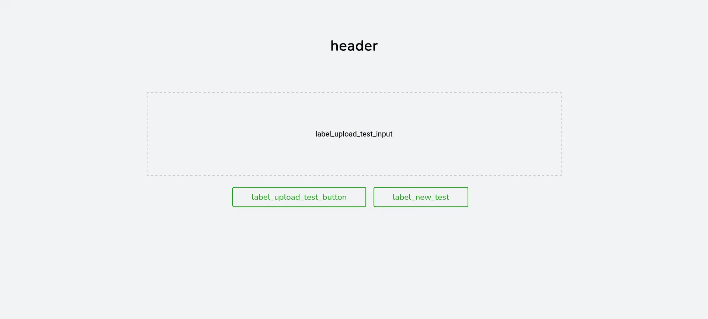
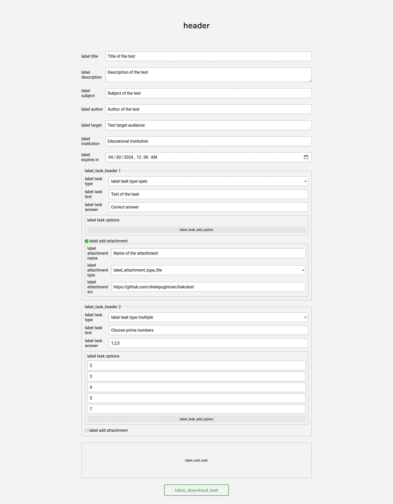
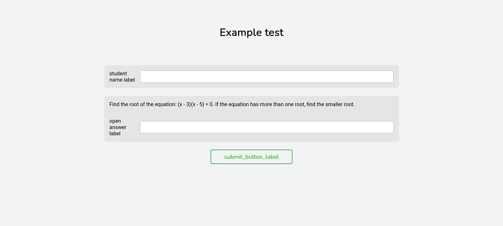

# Web pages

Hakutest web pages internationalization, specified under the `web` field in the internationalization file.

## Fields

### `editor`

Customizes [test editor page](/docs/app/test-editor) static text.

**Options**:

-   `header` - Test editor page header.
-   `label_title` - Title input label.
-   `label_description` - Description input label.
-   `label_subject` - Subject input label.
-   `label_author` - Author input label.
-   `label_target` - Target audience input label.
-   `label_institution` - Educational institution input label.
-   `label_expires_in` - Expiration time input label.
-   `label_add_task` - Text of the button that adds new task.
-   `label_task_header` - Header of the task (input group).
-   `label_task_type` - Task type input label.
-   `label_task_type_single` - Single answer type label.
-   `label_task_type_multiple` - Multiple answers type label.
-   `label_task_type_open` - Open question type label.
-   `label_task_type_file` - File question type label.
-   `label_task_text` - Task text input label.
-   `label_task_answer` - Task correct answer input label.
-   `label_task_options` - Task answer options input label.
-   `label_task_add_option` - Text of the button that adds new answer option.
-   `label_add_attachment` - Add attachment checkbox label.
-   `label_attachment_name` - Attachment name input label.
-   `label_attachment_type` - Attachment type input label.
-   `label_attachment_type_file` - File type label.
-   `label_attachment_type_image` - Image type label.
-   `label_attachment_type_video` - Video type label.
-   `label_attachment_type_audio` - Audio type label.
-   `label_attachment_src` - Attachment source (i.e. URL) input label.
-   `label_upload_test_input` - Test file upload input text.
-   `label_upload_test_button` - Test upload button text.
-   `label_new_test` - Create new test button text.
-   `label_download_test` - Test download button text.

**Visual examples**:

Editor test upload page:



Test editor page:



### `error`

Internationalization of the error page.

**Options**:

-   `header` - Header of the error page.
-   `details` - Error details header (summary).

**Visual example**:


### `expired`

Internationalization of the [expired test page](/docs/app/test-page#expired-test).

**Options**:

-   `header` - Header of the expired test page.
-   `message` - Message with additional information.

**Visual example**:


### `search`

Internationalization of the [search page](/docs/app/search-page).

**Options**:

-   `input_placeholder` - Placeholder text of the search input field.
-   `search_button_label` - Text of the search button.

**Visual example**:


### `submitted`

Internationalization of the [submission page](/docs/app/test-page#test-results).

**Options**:

-   `header` - Header of the test submission page.
-   `message` - Message with additional information.

**Visual example**:


### `test`

Internationalization of the [test page](/docs/app/test-page).

**Options**:

-   `student_name_label` - Label of student name input.
-   `open_answer_label` - Label of open question answer input.
-   `submit_button_label` - Text of test solution submission button.

**Visual example**:



## Example

Example of the web user interface internationalization:

```yaml title='i18n.yaml'
web:
    editor:
        header: Test Editor
        label_title: 'Title:'
        label_description: 'Description:'
        label_subject: 'Subject:'
        label_author: 'Author:'
        label_target: 'Target audience:'
        label_institution: 'Institution:'
        label_expires_in: 'Expires in:'
        label_add_task: + Add task
        label_task_header: Task
        label_task_type: 'Type:'
        label_task_type_single: Single answer
        label_task_type_multiple: Multiple answers
        label_task_type_open: Open question
        label_task_type_file: 'Answer with file(s)'
        label_task_text: 'Text:'
        label_task_answer: 'Answer:'
        label_task_options: Answer options
        label_task_add_option: + Add option
        label_add_attachment: Add attachment
        label_attachment_name: 'Name:'
        label_attachment_type: 'Type:'
        label_attachment_type_file: File
        label_attachment_type_image: Image
        label_attachment_type_video: Video
        label_attachment_type_audio: Audio
        label_attachment_src: 'Source (URL):'
        label_upload_test_input: Upload test file
        label_upload_test_button: Upload and edit
        label_new_test: Create new test
        label_download_test: Download test
    error:
        header: An error occurred!
        details: Details
    expired:
        header: Test expired!
        message: This test is no longer available
    search:
        input_placeholder: Search for the test
        search_button_label: Search
    submitted:
        header: Submitted!
        message: The test results are not displayed according to the system settings
    test:
        student_name_label: 'Your name:'
        open_answer_label: 'Answer:'
        submit_button_label: Submit
# Other fields...
```
