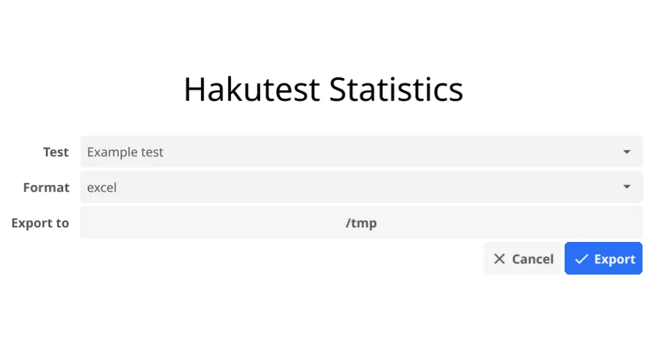

# Excel

Student test results can be exported to an Excel spreadsheet via two methods:

-   By using the `hakutest-statistics` executable (recommended for most users).
-   By using the `hakutest statistics` command.

## Data format

On the test results page, there is a table displaying the student's scores and the percentage of tasks they completed correctly:


On the statistics page, there is a table displaying the correctness of tasks performed by students:


-   Each cell contains an answer submitted by this student.
-   Green cells represent a correct answer.
-   Red cells represent an incorrect answer.
-   If the cell is empty, student didn't submit answer for this task.

:::tip

You can change the static text of the spreadsheet by changing the configuration parameters. See [Statistics internationalization](/docs/i18n/stats#excel) for more information.

:::

## Using the `hakutest-statistics` executable

To export results statistics using the `hakutest-statistics` executable, follow the instruction bellow:

1. Run the `hakutest-statistics` (`hakutest-statistics.exe` on Windows).

2. In the opened window, select the test, export format, and the directory where the statistics will be exported:



3. Press the "Export" button to export statistics.

This will produce a file named `<test-name>.xlsx` (in this example, `Example test.xlsx`) in the selected export directory.

## Using the `hakutest statistics` command

Syntax: `hakutest statistics <test-name> excel`

_Where `test-name` is the name of the test results folder (i.e. its file name) which statistics you want to export_.

This command creates a file named `<test-name>.xlsx` in the current working directory - Excel spreadsheet with exported statistics.

### Example

Assume there is a "My test" folder with test results in the results directory.

```shell title='Command'
hakutest statistics "My test" excel
```

This command will create a file `My test.xlsx` in the current working directory.

:::tip

See [`statistics` command](/docs/cli/statistics) for more information.

:::
