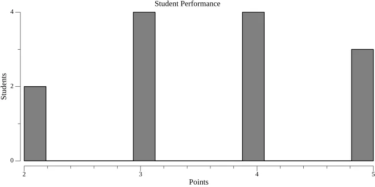

# Histogram

Student test results can be exported to a histogram via two methods:

-   By using the `hakutest statistics` command.
-   If you are using the Windows version of Hakutest with scripts, you can run the file `stats_image.bat`.

## Data format

Test results statistics is exported as a PNG image with histogram as follows:



-   The horizontal axis indicates the number of points scored by students.
-   The vertical axis indicates the quantity of students who scored this number of points.

:::tip

You can change the static text of the histogram by changing the configuration parameters. See [Statistics internationalization](/docs/i18n/stats#image) for more information.

:::

## Using `hakutest statistics` command

Syntax: `hakutest statistics <test-name> excel`

_Where `test-name` is the name of the test results folder (i.e. its file name) which statistics you want to export_.

This command creates a file named `<test-name>.png` in the current working directory - PNG histogram with exported statistics.

### Example

Assume there is a "My test" folder with test results in the results directory.

```shell title='Command'
hakutest statistics "My test" image
```

This command will create a file `My test.png` in the current working directory.

:::tip

See [`statistics` command](/docs/cli/statistics) for more information.

:::

## Using `stats_image.bat` script

Assume there is a "My test" folder with test results in the results directory.

1. Double-click file `stats_image.bat` in the Hakutest installation directory:

    ```txt {4} title='Directory structure'
    hakutest/
        hakutest.exe
        ...
        stats_image.bat
    ```

2. Script will prompt you for a test filename:

    > ```
    > Enter the name of the test:
    > ```

3. Enter the filename of the test which statistics you want to export:

    > ```
    > Enter the name of the test: My test
    > ```

4. It will create a PNG image in this directory:

    ```txt {5} title='Directory structure'
    hakutest/
        hakutest.exe
        ...
        stats_image.bat
        My test.png
    ```
