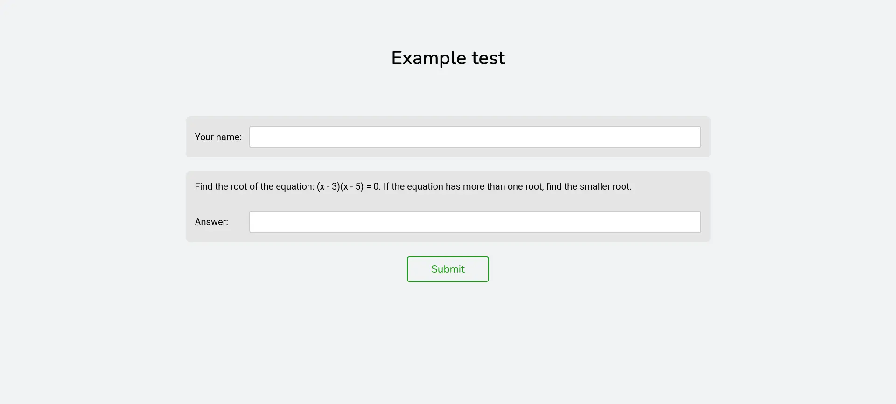
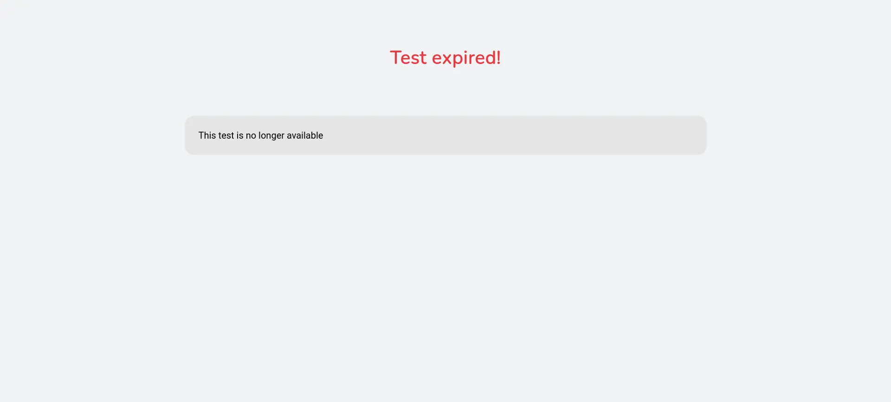

# Test page

The test page allows student to solve the test and submit their answers.



When the server is running, it can be accessed from any device in the local network at the following URL:

`http://<local-ip-of-your-device>:<port>/<name-of-the-test-file>`

Where:

-   `local-ip-of-your-device` &mdash; The local IP address of the device running the Hakutest server.
-   `port` &mdash; The port on which server is listening (see [Server configuration](/docs/configuration/server#port)).
-   `name-of-the-test-file` &mdash; Filename of the test you want to access. The test file should be placed in the tests directory (see [General configuration](/docs/configuration/general#tests_directory)).

:::tip

To find out your local IP address, see [Local IP address guide](/docs/guide/local-ip).

:::

### Example

Let's assume that:

-   The local IP of your device is `192.168.1.34`.
-   The port on which the server is running is `8080`.
-   The `tests` directory is located in the `./data/tests`
-   The `tests` directory contains the `my-test.json` file.

```txt title='Directory structure'
hakutest/
    hakutest(.exe)
    data/
        tests/
            my-test.json
```

In this example, when the server is running, you can access the test `my-test` at http://192.168.1.34:8080/my-test.

:::note

Test file extension (`.json`) can be omitted.

In the example above, both URLs point to `my-test`:

-   http://192.168.1.34:8080/my-test
-   http://192.168.1.34:8080/my-test.json

:::

### Test results

Once the student submits their solution to the test, they will see their results. The results page contains the student's name, the points scored, and the percentage of correctly solved tasks.


You can choose not to display results to students by specifying a value of `false` in the `general.show_results` field of the configuration file (see [General configuration](/docs/configuration/general#show_results)). In this case, Hakutest will display a page indicating that the solution was submitted without showing the actual score:


By default the system does not allow results to be overwritten if the same student resubmits the solution. You can allow results to be overwritten by specifying a value of `true` in the `general.overwrite_results` field in the configuration file (see [General Configuration](/docs/configuration/general#overwrite_results)). In this case Hakutest will overwrite the results on resubmission.

### Expired test

If the test has expired, it will not be available at this URL. Instead of the test, a page will be displayed informing you that the test has expired:



This page will also be displayed when the student attempts to submit answers to an expired test.
