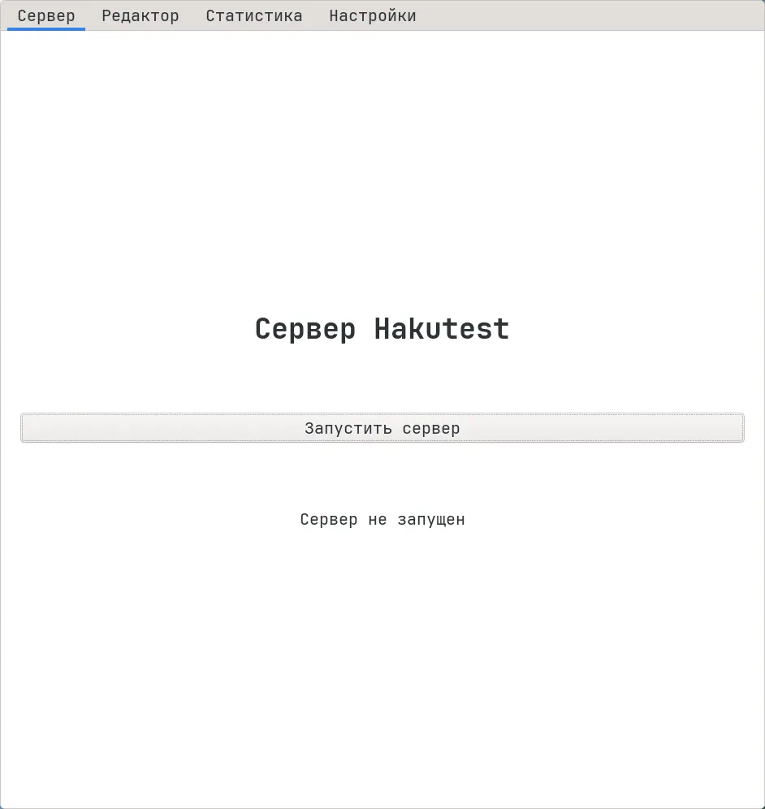
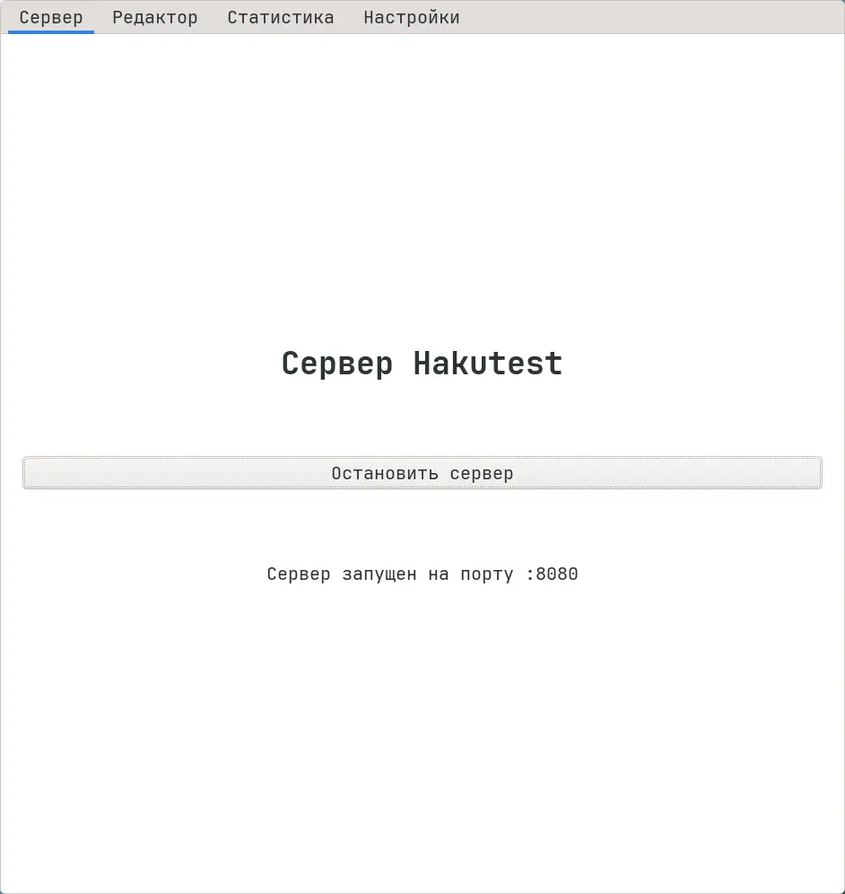

# Управление сервером из графического приложения

Чтобы управлять сервером Hakutest, используя графическое приложение, следуйте
инструкциям ниже:

1.  Перейдите на вкладку "Сервер":

2.  Чтобы запустить сервер, нажмите кнопку "Запустить сервер":

3.  Повторно нажмите кнопку для остановки сервера.
