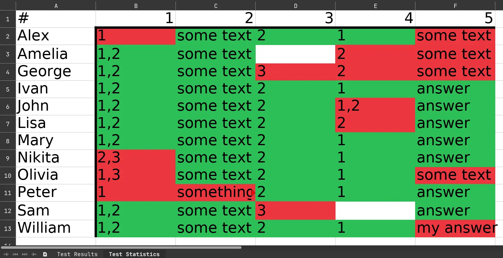

# Excel

Результаты тестирований могут быть экспортированы в Excel-таблицу двумя методами:

-   [Через графическое приложение](/docs/gui/statistics) (рекомендуется).
-   [При помощи команды `hakutest statistics`](/docs/cli/statistics).

## Формат данных

На листе результатов находится таблица, отображающая баллы учеников и процент правильности решённых заданий

На листе статистики находится таблица с подробной информацией о правильности решения каждого задания учениками:

-   Каждая ячейка содержит ответ ученика.
-   Зелёные ячейки обозначают верный ответ.
-   Красные ячейки обозначают неверный ответ.
-   Пустые ячейки обозначают, что ученик не отправил ответ на это задание.
