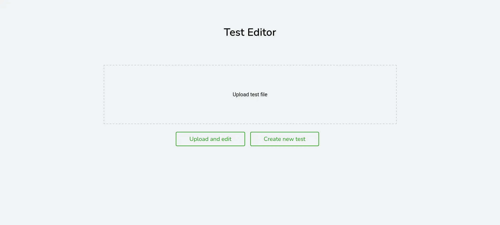
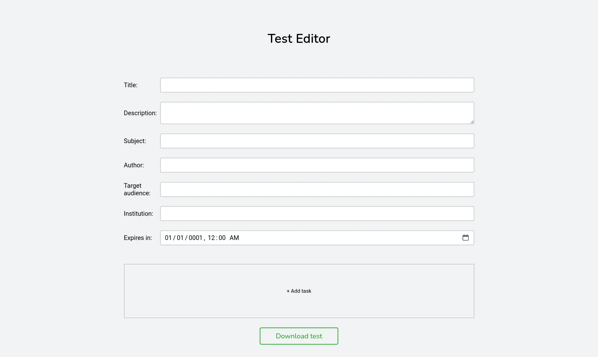
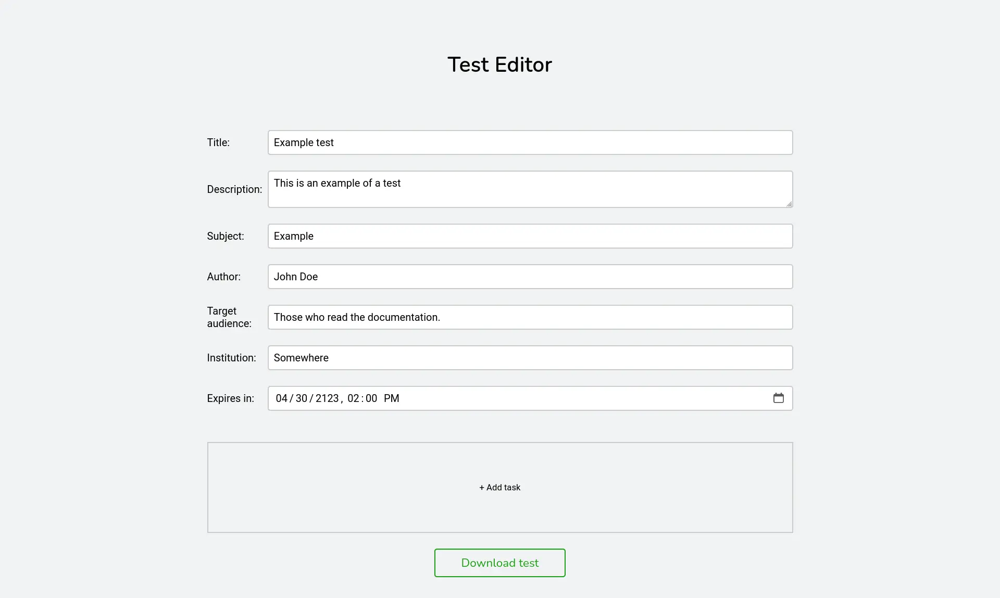
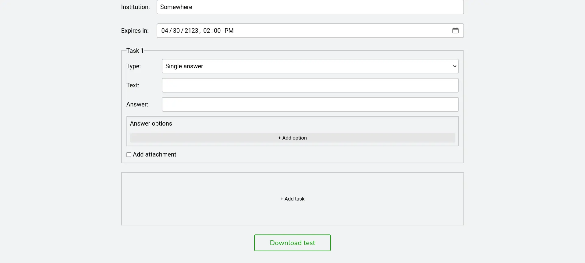
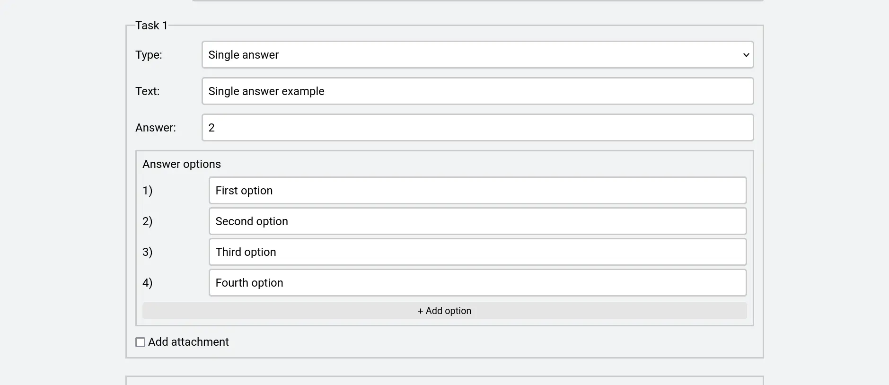
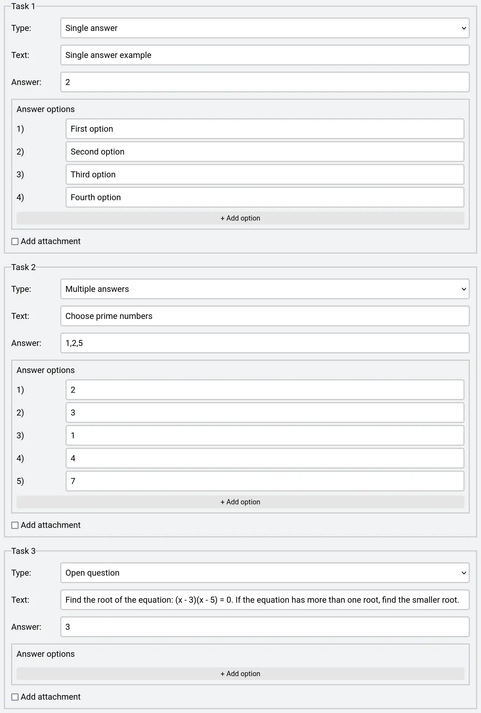
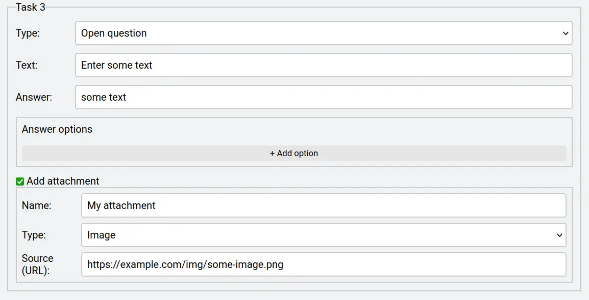

# Редактор тестов

Редактор тестов позволяет создавать и редактировать файлы тестов.

Когда сервер запущен, он доступен по адресу:

`http://localhost:<порт>/editor/upload`

Где `порт` - порт, который прослушивает сервер.

Адрес редактора по умолчанию: http://localhost:8080/editor/upload.

## Using the editor

:::tip

Для получения дополнительной информации о структуре тестов рекомендуется прочитать [Руководство по тестам] (/docs/guide/tests).

:::

### Создание нового теста

Чтобы создать новый тест, нажмите на кнопку "Создать новый тест".

### Редактирование существующего тест

Чтобы открыть существующий тест для редактирования, следуйте инструкции:

1.  Загрузите файл теста, который вы хотите отредактировать, нажав на поле "Загрузить файл теста".
2.  Нажмите на кнопку "Редактировать тест".

### Редактор

Когда вы выбрали один из вариантов выше, откроется страница с редактором теста, в котором можно изменять его поля:

:::tip

Чтобы создать тест без времени истечения, оставьте поле "Доступен до" без изменений или пустым.

:::

### Добавление заданий

Чтобы добавить задание в тест, нажмите кнопку "+ Добавить задание":

Пример для остальных типов заданий:

### Добавление вложений

Вы также можете добавить вложения к заданию, включив опцию "Добавить вложение"

### Скачивание теста

Когда вы завершите редактирования теста, вы можете скачать его, нажав "Скачать тест".

Не забудьте положить файл в папку с тестами, чтобы иметь к нему доступ.
