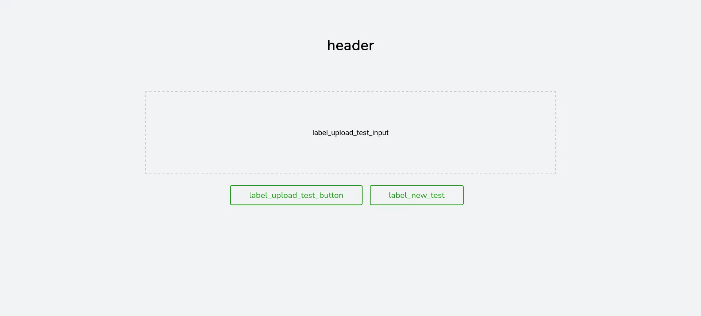
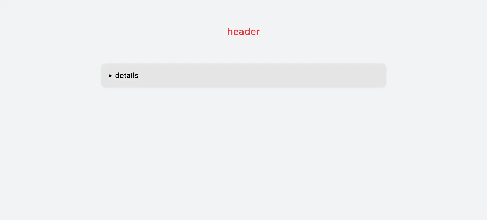
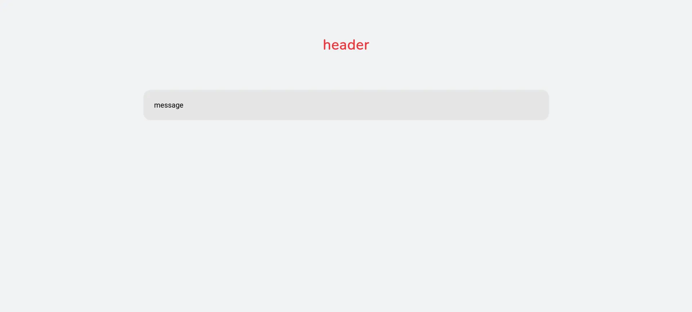
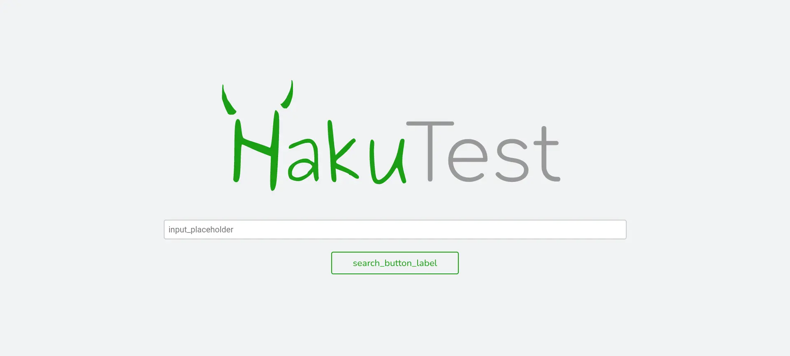
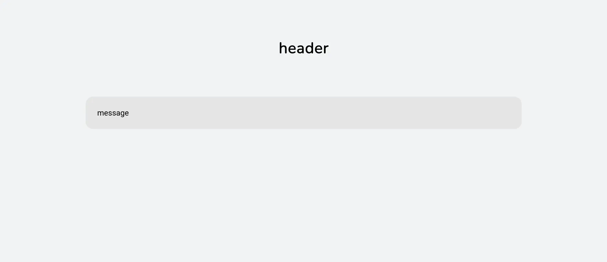
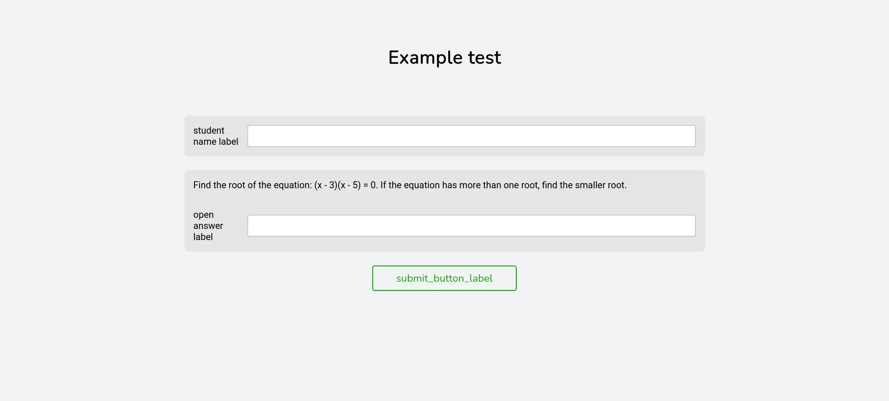

# Интерфейс

Кастомизация пользовательского интерфейса Hakutest. Определена в секции `ui` конфигурационного файла.

:::tip

Так как кастомизация пользовательского интерфейса позволяет изменять весь статический текст страниц, она также реализует интернационализацию.

:::

## Поля

### `editor`

Кастомизация [Веб-редактора тестов](/docs/app/test-editor).

**Параметры**:

-   `header` - Заголовок страницы редактора тестов.
-   `label_title` - Подпись поля ввода названия теста.
-   `label_description` - Подпись поля ввода описания теста.
-   `label_subject` - Подпись поля ввода темы теста.
-   `label_author` - Подпись поля ввода автора теста.
-   `label_target` - Подпись поля ввода целевой аудитории теста.
-   `label_institution` - Подпись поля ввода образовательного учреждения.
-   `label_expires_in` - Подпись поля ввода времени истечения теста.
-   `label_add_task` - Текст кнопки добавления новых заданий.
-   `label_task_header` - Заголовок задания (группы полей ввода).
-   `label_task_type` - Подпись поля ввода типа задания.
-   `label_task_type_single` - Подпись типа задания с одним вариантом ответа.
-   `label_task_type_multiple` - Подпись типа задания с несколькими вариантами ответа.
-   `label_task_type_open` - Подпись типа задания с открытым ответом.
-   `label_task_text` - Подпись поля ввода текста задания.
-   `label_task_answer` - Подпись поля ввода правильного ответа на задание.
-   `label_task_options` - Подпись поля ввода вариантов ответа.
-   `label_task_add_option` - Текст кнопки добавления вариантов ответа.
-   `label_add_attachment` - Текст опции добавления вложения.
-   `label_attachment_name` - Подпись поля ввода названия вложения.
-   `label_attachment_type` - Подпись поля ввода типа вложения.
-   `label_attachment_type_file` - Подпись вложения типа "Файл".
-   `label_attachment_type_image` - Подпись вложения типа "Изображение".
-   `label_attachment_type_video` - Подпись вложения типа "Видео".
-   `label_attachment_type_audio` - Подпись вложения типа "Аудио".
-   `label_attachment_src` - Подпись поля ввода источника вложения.
-   `label_upload_test_input` - Текст поля добавления файла теста.
-   `label_upload_test_button` - Текст кнопки загрузки теста для редактирования.
-   `label_new_test` - Текст кнопки создания нового теста.
-   `label_download_test` - Текст кнопки скачивания теста.

**Визуальный примерs**:

Страница загрузки теста для редактирования:



Страница редактора теста:


### `error`

Кастомизация страницы ошибки.

**Параметры**:

-   `header` - Залоговок страницы.
-   `details` - Подпись информации об ошибке.

**Визуальный пример**:



### `expired`

Кастомизация [страницы теста с истекшим сроком действия](/docs/app/test-page#expired-test).

**Параметры**:

-   `header` - Залоговок страницы.
-   `message` - Сообщение с дополнительной информацией для ученика.

**Визуальный пример**:



### `search`

Кастомизация [страницы поиска](/docs/app/search-page).

**Параметры**:

-   `input_placeholder` - Текст поля ввода названия теста.
-   `search_button_label` - Текст кнопки поиска.

**Визуальный пример**:



### `submitted`

Кастомизация [страницы отправленного решения](/docs/app/test-page#результаты-тестирования)

**Параметры**:

-   `header` - Залоговок страницы.
-   `message` - Сообщение с дополнительной информацией для ученика.

**Визуальный пример**:



### `test`

Кастомизация [страницы теста](/docs/app/test-page).

**Параметры**:

-   `student_name_label` - Подпись поля ввода имени ученика.
-   `open_answer_label` - Подпись поля ввода ответа для заданий с открытым ответом.
-   `submit_button_label` - Текст кнопки отправки решения.

**Визуальный пример**:



## Пример

Пример секции `ui` конфигурационного файла.

```yaml title='config.yaml'
ui:
    editor:
        header: Редактор тестов
        label_title: 'Название:'
        label_description: 'Описание:'
        label_subject: 'Тема:'
        label_author: 'Автор:'
        label_target: 'Целевая аудитория:'
        label_institution: 'Уч. заведение:'
        label_expires_in: 'Доступен до:'
        label_add_task: + Добавить задание
        label_task_header: Задание
        label_task_type: 'Тип:'
        label_task_type_single: Один вариант ответа
        label_task_type_multiple: Несколько вариантов ответа
        label_task_type_open: Открытый вопрос
        label_task_text: 'Текст:'
        label_task_answer: 'Ответ:'
        label_task_options: Варианты ответов
        label_task_add_option: + Добавить вариант ответа
        label_add_attachment: Добавить приложение
        label_attachment_name: 'Название:'
        label_attachment_type: 'Тип:'
        label_attachment_type_file: Файл
        label_attachment_type_image: Изображение
        label_attachment_type_video: Видео
        label_attachment_type_audio: Аудио
        label_attachment_src: 'Источник (URL):'
        label_upload_test_input: Выберите файл теста
        label_upload_test_button: Загрузить и редактировать
        label_new_test: Создать новый тест
        label_download_test: Скачать тест
    error:
        header: Произошла ошибка!
        details: Подробно
    expired:
        header: Тест больше не доступен!
        message: Срок выполнения данного теста истёк
    search:
        input_placeholder: Искать тесты
        search_button_label: Искать
    submitted:
        header: Ответы сохранены!
        message: 'В соответствии с настройками системы, результаты не отображаются'
    test:
        student_name_label: 'ФИО:'
        open_answer_label: 'Ответ:'
        submit_button_label: Отправить
# Остальные поля...
```
