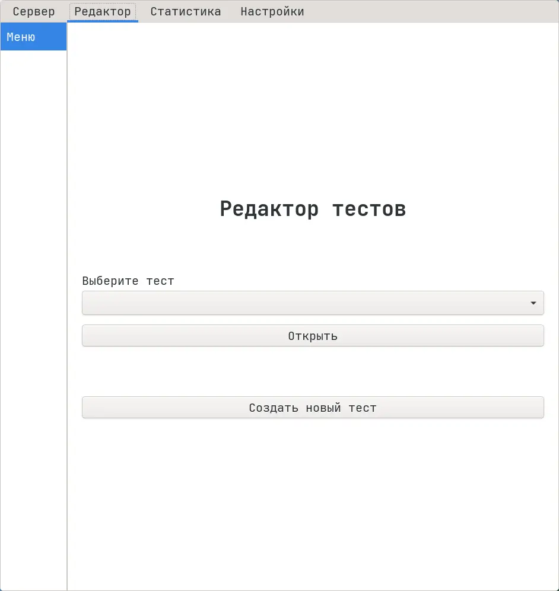
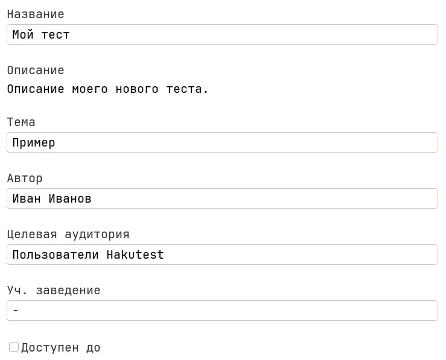
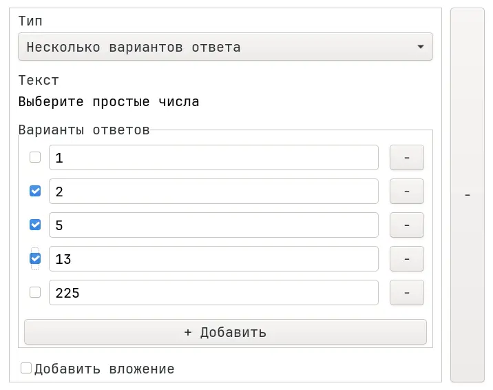
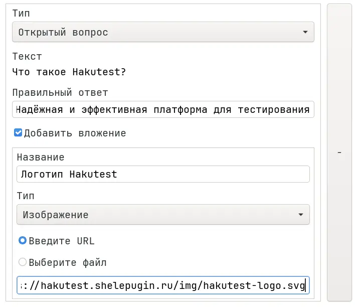

# Редактор тестов

Hakutest предоставляет мощный и удобный графический редактор тестов. Он
позволяет создавать новые тесты и изменять существующие.

Чтобы использовать редактор, следуйте инструкциям ниже:

1.  Перейдите на вкладку "Редактор":

2.  Выберите тест и нажмите кнопку "Открыть" или нажмите "Создать новый тест".

3.  Заполните общие поля:

4.  Добавьте задания в ваш тест:

5. Когда вы закончите редактирование теста, нажмите кнопку "Сохранить тест".
   Hakutest автоматически сохранит ваш тест в каталоге тестов, чтобы он был
   доступен вашим ученикам.

:::tip

Чтобы узнать больше о тестах и их структуре, см. [Тесты](/docs/guide/tests).

:::
