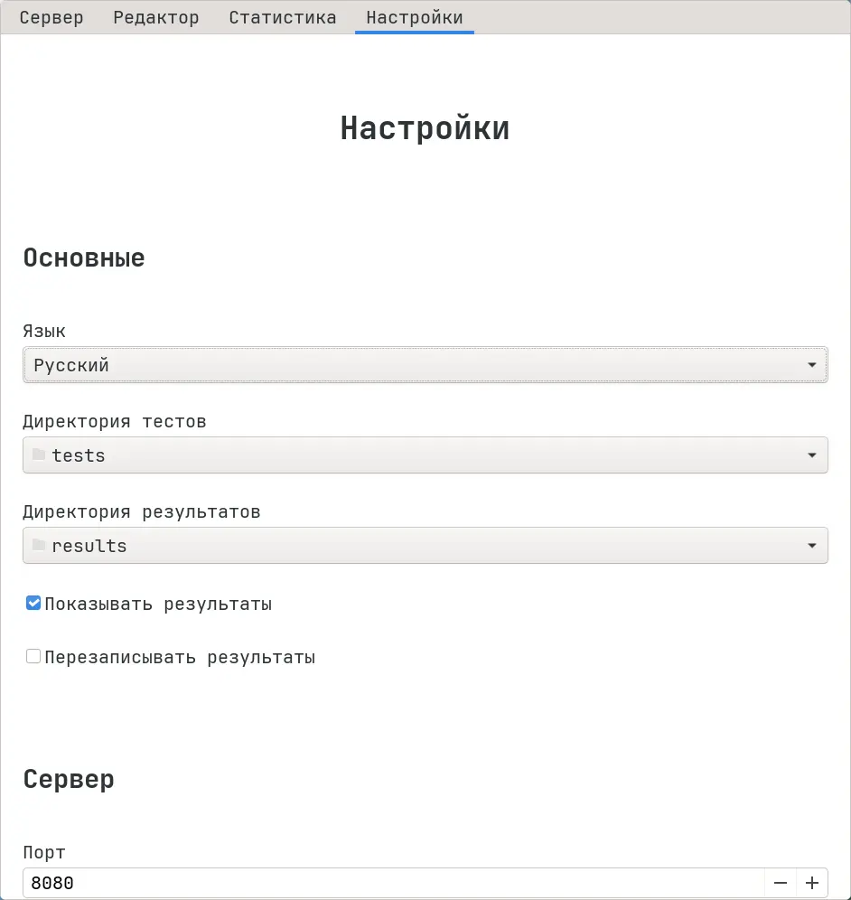

# Настройка Hakutest через графическое приложение

Вы можете настраивать Hakutest, используя графическое приложение:

1.  Перейдите на вкладку "Настройки":

2.  Измените параметры в соответствии с вашими потребностями.

3.  Нажмите на кнопку "Сохранить", чтобы записать настройки.

:::tip

Чтобы узнать больше о конфигурации Hakutest, см.
[О конфигурации](/docs/configuration/about).

:::
