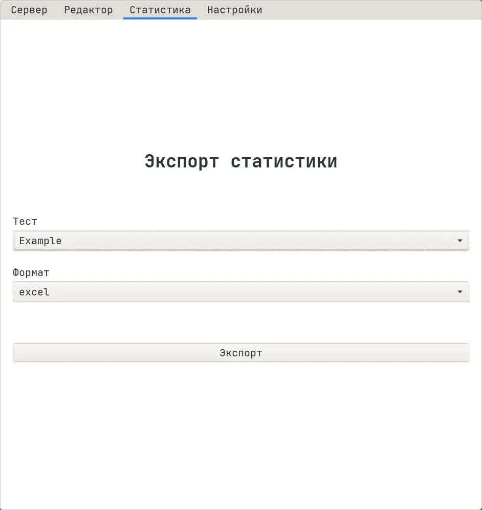

# Экспорт статистики тестов из графического приложения

Чтобы экспортировать статистику, используя графическое приложение, следуйте
инструкции ниже:

1.  Перейдите на вкладку "Статистика":

2.  Выберите тест и формат экспорта.
3.  Нажмите кнопку "Экспортировать".

Статистика выбранного теста будет сохранена в "Загрузках" системы.

:::tip

Чтобы узнать больше о статистике тестов, см.
[О статистике](/docs/statistics/about).

:::
