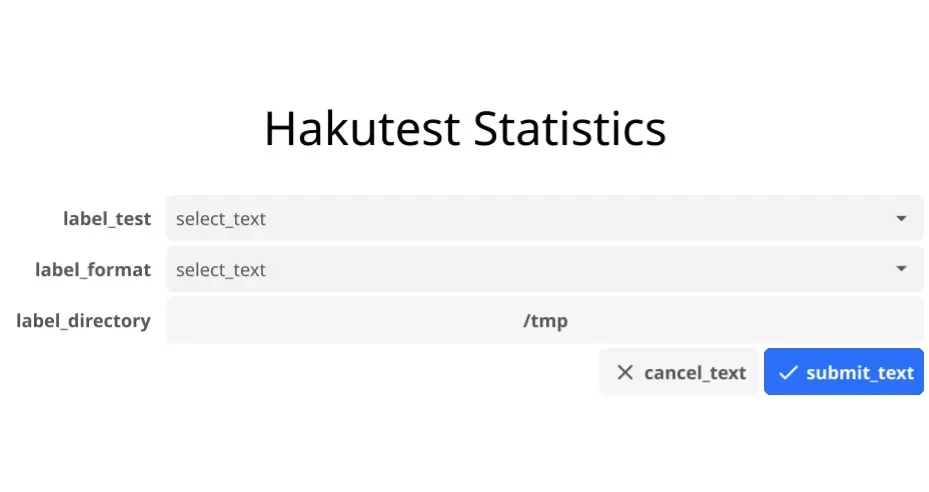
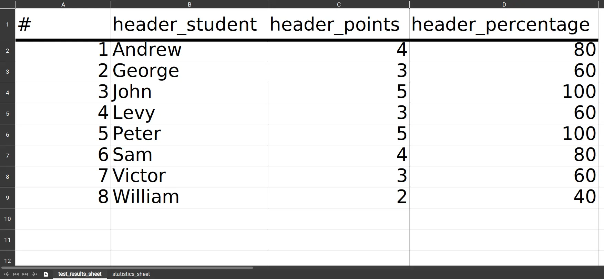
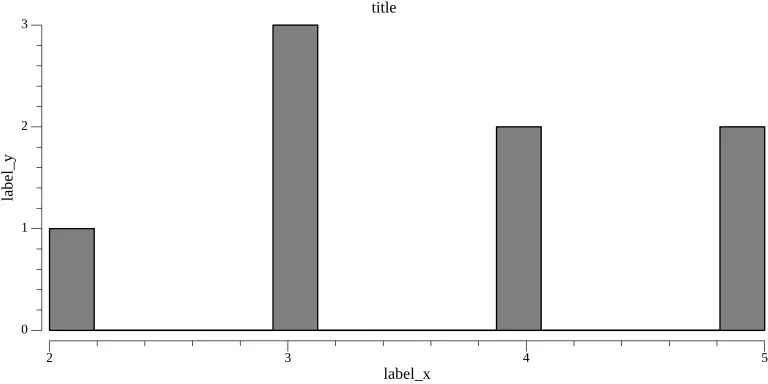

# Статистика

Интернационализация экспорта данных учеников, их результатов и статистики. Определены в секции `stats` файла интернационализации.

## Поля

### `app`

Интернационализация программы `hakutest-statistics`.

**Параметры**

- `label_test`: Подпись поля выбора теста.
- `label_format`: Подпись поля выбора формата экспорта.
- `label_directory`: Подпись поля выбора директории экспорта.
- `submit_text`: Текст кнопки подтверждения формы.
- `cancel_text`: Текст кнопки отмены формы.
- `select_text`: Текст полей выбора по умолчанию.
- `success_text`: Сообщение в уведомлении об успешном экспорте.
- `error_prefix`: Префикс сообщения в уведомлении об ошибке. К нему добавляется текст самой ошибки.

**Визуальный пример**



**Пример уведомлений**

- Success:

    >   Hakutest Statistics
    >
    >   `success_text`

- Error:

    >   Hakutest Statistics
    >
    >   `error_prefix` `<Текст возникшей ошибки>`

### `excel`

Определяет настройки экспорта данных в Excel-таблицу.

**Параметры**:

-   `test_results_sheet` - Название листа с результатами учеников.
-   `statistics_sheet` - Название листа со статистикой.
-   `header_student` - Заголовок столбца имён учеников.
-   `header_points` - Заголовок столбца набранных баллов.
-   `header_percentage` - Заголовок столбца процента правильно решённых заданий.

**Визуальный пример**:



### `image`

Определяет настройки экспорта данных в PNG-гистограмму.

**Параметры**:

-   `title` - Название гистограммы.
-   `label_x` - Подпись оси Ox (набранные баллы).
-   `label_y` - Подпись оси Oy (количество учеников).

**Визуальный пример**:



## Пример

Пример секции `stats` файла интернационализации:

```yaml title='i18n.yaml'
stats:
    app:
        label_test: Тест
        label_format: Формат
        label_directory: Экспортировать в
        submit_text: Экспорт
        cancel_text: Отмена
        select_text: "(Выберите вариант)"
        success_text: "Статистика успешно экспортирована!"
        error_prefix: "Произошла ошибка! Подробно:"
    excel:
        header_percentage: "%"
        header_points: Баллы
        header_student: Ученик
        statistics_sheet: Статистика
        test_results_sheet: Результаты
    image:
        label_x: Баллы
        label_y: Ученики
        title: Успеваемость
# Остальные поля...
```
