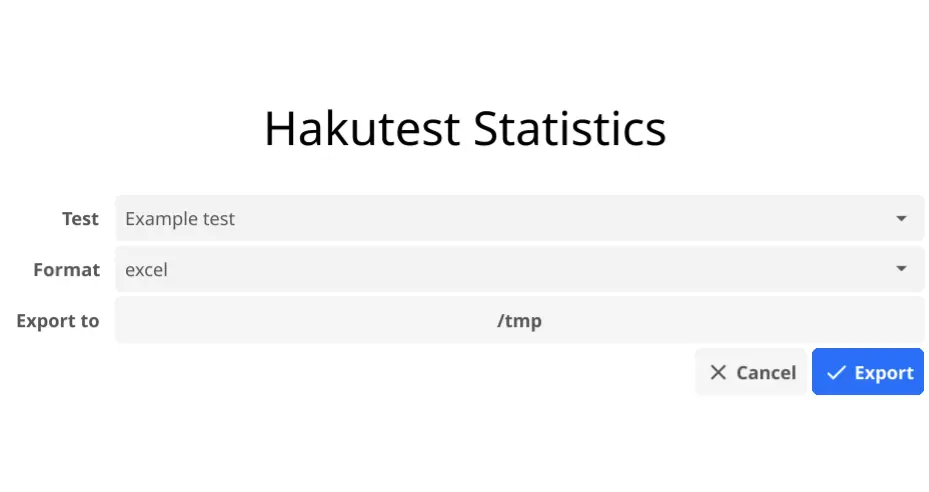

# Excel

Результаты тестирований могут быть экспортированы в Excel-таблицу двумя методами:

-   При помощи `hakutest-statistics`.
-   При помощи команды `hakutest statistics`.

## Формат данных

На листе результатов находится таблица, отображающая баллы учеников и процент правильности решённых заданий


На листе статистики находится таблица с подробной информацией о правильности решения каждого задания учениками:


-   Каждая ячейка содержит ответ ученика.
-   Зелёные ячейки обозначают верный ответ.
-   Красные ячейки обозначают неверный ответ.
-   Пустые ячейки обозначают, что ученик не отправил ответ на это задание.

:::tip

Вы можете менять статичный текст таблицы, указав нужные значения в конфигурации. Для более подробной информации см. [Интернационаонализация статистики](/docs/i18n/stats#excel).

:::

## Использование `hakutest-statistics`

Чтобы экспортировать статистику, используя `hakutest-statistics`, следуйте инструкции ниже:

1. Запустите исполняемый файл `hakutest-statistics` (`hakutest-statistics.exe` на Windows).

2. В открытом окне выберите тест, формат экспорта и директорию, в которую будет экспортирована статистика:



3. Нажмите на кнопку "Export" ("Экспорт"), чтобы экспортировать статистику.

Это создаст файл `<название-теста>.xlsx` (в данном примере, `Example test.xlsx`) в выбранной директории.

## Использование команды `hakutest statistics`

Синтаксис: `hakutest statistics <название-теста> excel`

_Где `название-теста` - название папки результатов теста (т.е. название его файла), статистику которого вы хотите экспортировать_.

Эта команда создаст файл `<название-теста>.xlsx` (таблицу Excel с результатами тестирования) в текущей рабочей директории.

### Пример

Предположим, в директории результатов есть папка "My test" с результатами тестирования.

```shell title='Команда'
hakutest statistics "My test" excel
```

Эта команда создаст файл `My test.xlsx` в текущей рабочей директории.

:::tip

Для более подробной информации см. [Команда `statistics`](/docs/cli/statistics).

:::
