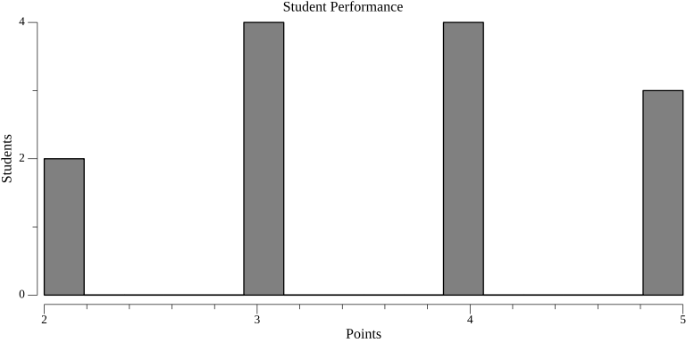
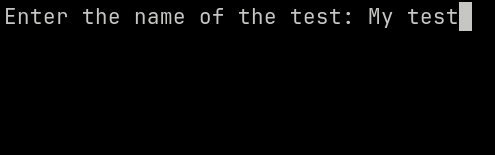

# Гистограмма

Результаты тестирований могут быть экспортированы в PNG гистограмму двумя методами:

-   При помощи команды `hakutest statistics`.
-   Если вы используете версию Hakutest для Windows со скриптами, вы можете запустить файл `stats_image.bat`.

## Формат данных

Результаты тестирования экспортируются в PNG-изображение с гистограммой следующим образом:



-   Горизонтальная ось обозначает количество баллов, набранных учениками.
-   Вертикальная ось обозначает количество учеников, набравших этот балл.

:::tip

Вы можете менять статичный текст гистограммы, указав нужные значения в конфигурации. Для более подробной информации см. [Конфигурация статистики](/docs/configuration/stats#image).

:::

## Использование команды `hakutest statistics`

Синтаксис: `hakutest statistics <название-теста> image`

_Где `название-теста` - название папки результатов теста (т.е. название его файла), статистику которого вы хотите экспортировать_.

Эта команда создаст файл `<название-теста>.png` (изображение PNG с гистограммой) в текущей рабочей директории.

### Пример

Предположим, в директории результатов есть папка "My test" с результатами тестирования.

```shell title='Команда'
hakutest statistics "My test" image
```

Эта команда создаст файл `My test.png` в текущей рабочей директории.

:::tip

Для более подробной информации см. [Команда `statistics`](/docs/cli/statistics).

:::

## Использование скрипта `stats_image.bat`

Предположим, в директории результатов есть папка "My test" с результатами тестирования.

1. Запустите файл `stats_image.bat`, расположенный в директории установки Hakutest, двойным нажатием:

    ```txt {4} title='Структура папок'
    hakutest/
        hakutest.exe
        ...
        stats_excel.bat
    ```

2. Скрипт попросит ввести название теста:

    

3. Введите название нужного теста:

    

4. В той же папке будет создано изображение:

    ```txt {5} title='Структура папок'
    hakutest/
        hakutest.exe
        ...
        stats_excel.bat
        My test.png
    ```
