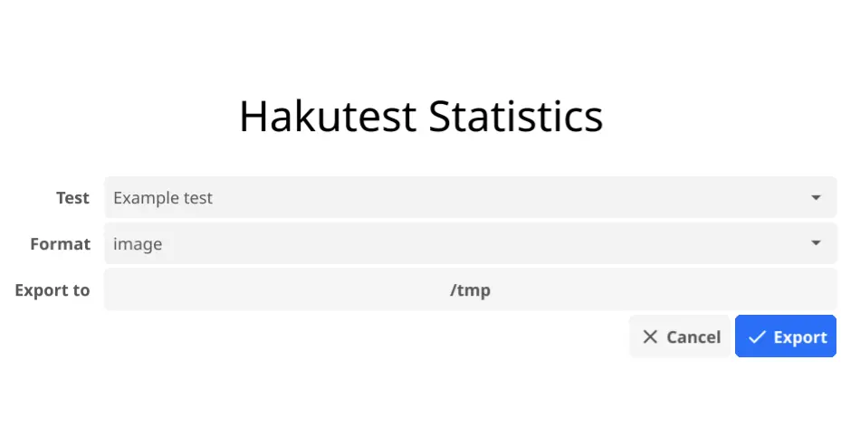

# Гистограмма

Результаты тестирований могут быть экспортированы в PNG гистограмму двумя методами:

-   При помощи `hakutest-statistics`.
-   При помощи команды `hakutest statistics`.

## Формат данных

Результаты тестирования экспортируются в PNG-изображение с гистограммой следующим образом:


-   Горизонтальная ось обозначает количество баллов, набранных учениками.
-   Вертикальная ось обозначает количество учеников, набравших этот балл.

:::tip

Вы можете менять статичный текст гистограммы, указав нужные значения в конфигурации. Для более подробной информации см. [Интернационаонализация статистики](/docs/i18n/stats#image).

:::

## Использование `hakutest-statistics`

Чтобы экспортировать статистику, используя `hakutest-statistics`, следуйте инструкции ниже:

1. Запустите `hakutest-statistics` (`hakutest-statistics.exe` на Windows).

2. В открытом окне выберите тест, формат экспорта и директорию, в которую будет экспортирована статистика:



3. Нажмите на кнопку "Export" ("Экспорт"), чтобы экспортировать статистику.

Это создаст файл `<название-теста>.png` (в данном примере, `Example test.png`) в выбранной директории.

## Использование команды `hakutest statistics`

Синтаксис: `hakutest statistics <название-теста> image`

_Где `название-теста` - название папки результатов теста (т.е. название его файла), статистику которого вы хотите экспортировать_.

Эта команда создаст файл `<название-теста>.png` (изображение PNG с гистограммой) в текущей рабочей директории.

### Пример

Предположим, в директории результатов есть папка "My test" с результатами тестирования.

```shell title='Команда'
hakutest statistics "My test" image
```

Эта команда создаст файл `My test.png` в текущей рабочей директории.

:::tip

Для более подробной информации см. [Команда `statistics`](/docs/cli/statistics).

:::
