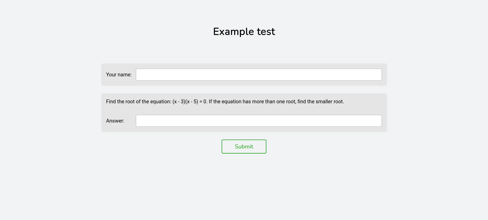
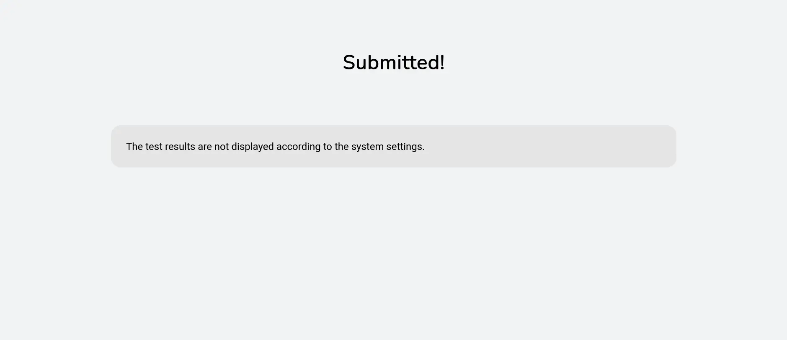
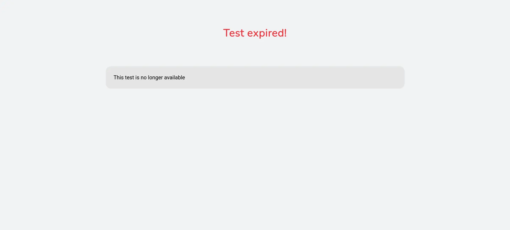

# Страница теста

Страница теста позволяет ученикам решать тест и отправлять свои ответы на проверку.



Когда сервер запущен, она доступна по следующему адресу в локальной сети:

`http://<локальный-ip-устройства>:<порт>/<имя-файла-теста>`

Где:

-   `локальный-ip-устройства` - Локальный IP-адрес устройства, на котором запущен сервер Hakutest server.
-   `порт` - Порт, который прослушивает сервер (см. [Конфигурация севрера](/docs/configuration/server#port)).
-   `имя-файла-теста` - Имя файла теста, который будет открыт. Файл должен находиться в директории тестов (см. [Основная конфигурация](/docs/configuration/general#tests_directory)).

:::tip

Чтобы узнать локальный IP-адрес устройства, см. [Локальный IP-адрес](/docs/guide/local-ip).

:::

### Пример

Допустим, что:

-   Локальный адрес вашего устройства: `192.168.1.34`.
-   Сервер прослушивает порт `8080`.
-   Директория тестов находится по пути `./data/tests`.
-   В директории тестов находится файл `my-test.json`.

```txt title='Структура папок'
hakutest/
    hakutest(.exe)
    data/
        tests/
            my-test.json
```

В этом случае, когда сервер запущен, вы можете открыть страницу поиска тестов по адресу http://192.168.1.34:8080/my-test.

:::note

Расширения файла теста (`.json`) можно опустить.
Test file extension (`.json`) can be omitted.

В примере выше, оба адреса относятся к тесту `my-test`:

-   http://192.168.1.34:8080/my-test
-   http://192.168.1.34:8080/my-test.json

:::

### Результаты тестирования

После того как учащийся отправит свое решение теста, он увидит свои результаты. На странице результатов указаны имя ученика, количество набранных баллов и процент правильно решенных задач.


Вы можете не показывать результаты ученикам, указав значение `false` в поле `general.show_results` конфигурационного файла (см. [Общая конфигурация](/docs/configuration/general#show_results)). В этом случае Hakutest отобразит страницу с информацией о том, что решение было отправлено, не показывая фактический балл:



По умолчанию система не позволяет переписывать результаты, если тот же студент повторно подает решение. Вы можете разрешить перезапись результатов, указав значение `true` в поле `general.overwrite_results` в файле конфигурации (см. [Общая конфигурация](/docs/configuration/general#overwrite_results)). В этом случае Hakutest будет перезаписывать результаты при повторной отправке.

### Тест с истекшим сроком действия

Если срок действия теста истек, он будет недоступен по этому адресу. Вместо теста будет отображена страница, информирующая о том, что срок действия теста истек:



Эта страница также будет отображаться при попытке отправить ответы на тест с истекшим сроком действия.
